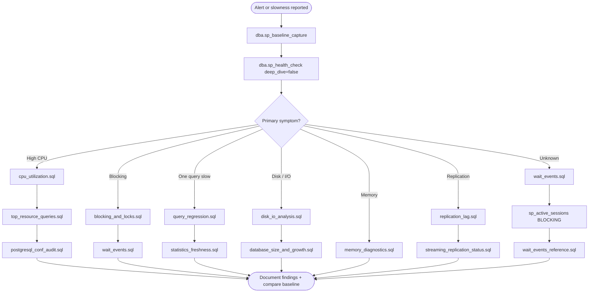

# DBA Essential Scripts — Multi-Platform Handbook

Production-oriented diagnostic handbooks for **Microsoft SQL Server** and **PostgreSQL**. Each platform folder contains read-only scripts for monitoring, troubleshooting, maintenance, and security — designed for junior through senior DBAs on live production systems.

**Author:** Ravi Sharma

**Jump to:** [Repository Layout](#repository-layout) | [Platform Comparison](#platform-comparison) | [SQL Server Handbook](#part-1-sql-server-dba-essential-scripts) | [PostgreSQL Handbook](#part-2-postgresql-dba-essential-scripts)

---

## Repository Layout

```
dba_essential_scripts/
├── README.md                 This file — complete documentation for both platforms
├── sql_server/               Microsoft SQL Server 2016+ (scripts, PowerShell, docs)
└── postgres/                 PostgreSQL 12+ (scripts, shell HTML generator)
```

> **Note:** All paths in Part 1 are relative to `sql_server/` unless prefixed with `sql_server/`. All paths in Part 2 are relative to `postgres/` unless prefixed with `postgres/`.

---

## Platform Comparison

| Area | SQL Server | PostgreSQL |
|------|------------|------------|
| Orchestrator | `sp_DBA_HealthCheck` | `dba.sp_health_check()` |
| Active sessions | `sp_DBA_ActiveSessions` | `dba.sp_active_sessions()` |
| Wait analysis | `sys.dm_os_wait_stats` (cumulative) | `pg_stat_activity` (point-in-time) |
| Query history | Query Store / plan cache | `pg_stat_statements` |
| HA/DR | Always On AG | Streaming / logical replication |
| Backups | `msdb` backup history | WAL archive, `pg_stat_archiver` |
| HTML handbook | `powershell/Generate-DBAHandbook.ps1` | `shell/generate-dba-handbook.sh` |
| Min version | SQL Server 2016+ | PostgreSQL 12+ |

---

## Design Principles

1. **Read-only by default** — diagnostic scripts do not modify data or settings (except deploy/governance).
2. **Layered troubleshooting** — OS → instance → storage → performance → indexes → HA/DR → security.
3. **Production-safe** — scope heavy scripts with parameters; document cumulative vs point-in-time metrics.
4. **Junior to senior** — each script header includes description, output, thresholds, and actions.

---


---

<a id="part-1-sql-server-dba-essential-scripts"></a>
# Part 1: SQL Server DBA Essential Scripts

A production-oriented **SQL Server diagnostic handbook** -- a curated library of read-only T-SQL scripts for monitoring, troubleshooting, and auditing Microsoft SQL Server instances. Scripts are organized by troubleshooting layer (OS -> instance -> storage -> performance -> indexes -> HA/DR -> security -> advanced features) and designed to run safely against production systems.

Includes a **PowerShell assessment framework** that generates self-contained HTML reports with health scores, findings, and collapsible detail panels.

**Author:** Ravi Sharma
**Platform:** Microsoft SQL Server (2016+; version-conditional logic through SQL Server 2025)

**Jump to:** [Quick Start](#quick-start) | [Installation](#installation-one-time-per-instance) | [Cheat Sheet](#dba-cheat-sheet-one-page) | [Troubleshooting Flow](#troubleshooting-flow) | [Script Catalog](#script-catalog)

---

## What This Project Is

This repository is **not** a single monolithic tool. It is a **modular DBA toolkit** that provides:

1. **Standalone diagnostic scripts** -- run individually during incidents or scheduled health checks.
2. **Shared framework objects** -- functions and procedures for cross-database execution, wait-type filtering, and consolidated reporting.
3. **An orchestrator** -- `sp_DBA_HealthCheck` aggregates findings into a prioritized dashboard with severity, impact, and recommended next steps.
4. **Modular wrapper procedures** -- `sp_DBA_WaitAnalysis`, `sp_DBA_IndexReview`, `sp_DBA_SecurityAudit`, `sp_DBA_BackupReview` for area-specific deep dives.
5. **Persistence layer** -- `sp_DBA_BaselineCapture` and `sp_DBA_SaveAssessmentRun` store results for historical trending.
6. **PowerShell HTML reports** -- one-command assessment with `Invoke-SqlOptimaAssessment.ps1`.

Use it as:

- A **daily/weekly health check** playbook for DBAs
- An **on-call incident** reference ("high CPU -> run these scripts in this order")
- A **learning path** for developers moving into DBA work (each script includes context and thresholds)
- A **consulting deliverable** -- HTML reports with health scores for customers and management

---

## Who It Is For

| Audience | How to use this repo |
|----------|----------------------|
| **Production DBA** | Deploy framework objects once; run `sp_DBA_HealthCheck` for triage; drill into folder scripts by area |
| **Junior DBA** | Start with `wait_statistics_reference.sql`; note instance uptime before interpreting cumulative DMVs |
| **Database developer** | Use blocking, plan cache, statistics, and Query Store scripts to diagnose application-impacting issues |
| **Consultant / Management** | Run PowerShell assessment for HTML report with health score and findings summary |

---

## Repository Structure

```
sql_server/
├── 00_Framework/                  Shared functions, stored procedures & install guide
│   ├── fn_DBA_ExcludedWaitTypes.sql
│   ├── fn_DBA_AgentRunDurationSeconds.sql
│   ├── sp_DBA_ForEachDatabase.sql
│   ├── sp_DBA_QueryStoreRegressions.sql
│   ├── sp_DBA_HealthCheck.sql
│   ├── sp_DBA_WaitAnalysis.sql
│   ├── sp_DBA_IndexReview.sql
│   ├── sp_DBA_SecurityAudit.sql
│   ├── sp_DBA_BackupReview.sql
│   ├── sp_DBA_ActiveSessions.sql
│   ├── sp_DBA_PlanCacheAnalyzer.sql
│   ├── sp_DBA_BaselineCapture.sql
│   ├── sp_DBA_SaveAssessmentRun.sql
│   ├── 00_Install_Framework.sql
│   ├── 00_Deploy_Framework.sql         (xp_cmdshell-based T-SQL deploy)
│   ├── 00_Deploy_Framework.ps1         (PowerShell deploy script — no xp_cmdshell needed)
│   └── README.md
├── 00_Repository/                 DBARepository DDL, deploy script, persistence, CheckId registry
├── 01_Server_OS/                  CPU, memory, disk latency
├── 02_Instance_Config/            sp_configure, OS integration, compatibility
├── 03_Storage_Engine/             Files, TempDB, VLFs
├── 04_Performance_Diagnostics/    Waits, blocking, top queries, plan cache
├── 05_Index_Statistics/           Usage, fragmentation, statistics, duplicates
├── 06_HA_DR/                      Always On, backups, log chain
├── 07_Security/                   Auth, encryption, logins
├── 08_Advanced/                   CDC, Query Store, replication, agent jobs
├── 09_Maintenance/                Failed jobs, CHECKDB history
├── 10_Capacity_Planning/          Growth forecasting
├── 11_Query_Store/                Plan regression diagnostics
├── 12_Extended_Events/            XE sessions, deadlocks
├── 13_Resource_Governor/          RG pools and workload groups
├── 14_Baselines/                  Point-in-time performance snapshots
├── preventive_measures/           Query protection & workload governance (Layered Automation)
│   ├── 01_Create_Governance_Database.sql
│   ├── 02_Capture_Running_Queries.sql
│   ├── 03_Check_Long_Running_Queries.sql
│   ├── 04_Check_Massive_DML.sql
│   ├── 05_Check_Blocked_Applications.sql
│   ├── 06_Enforce_Query_Policy.sql
│   ├── 07_Setup_Extended_Events.sql
│   ├── 08_Alert_Management.sql
│   ├── 09_Dashboard_Views.sql
│   ├── 10_Create_SQL_Agent_Jobs.sql
│   ├── 11_Setup_Resource_Governor.sql
│   └── README.md
├── powershell/                    Automated assessment & HTML reports
│   ├── Invoke-SqlOptimaAssessment.ps1
│   ├── Generate-HADRChecklist.ps1
│   ├── Private/                   Helper functions
│   ├── config/                    assessment.config.json
│   └── README.md
├── output/                        Generated reports (gitignored)
├── docs/                          Documentation & reference
│   ├── requirement_spec.md        Requirements specification
│   ├── watchdog.md                Preventive measures discussion
│   ├── toolkit_comparison.md      Toolkit comparison reference
│   └── templates/                 Report templates
├── DBA_essentials_utf8.md         Duplicate (UTF-8) in root
├── .gitignore                     Git ignore rules
└── README.md                      This file
```

---

## Prerequisites

### SQL Server version

| Version | Support |
|---------|---------|
| SQL Server 2016+ | Full support (Query Store, `dm_db_log_info`, IFI DMV on SP1+) |
| SQL Server 2017+ | Optional `STRING_AGG` paths replaced with 2016-compatible aggregation |
| SQL Server 2022+ | Full support with version-conditional logic for deprecated DMVs |
| SQL Server 2025+ | Full support — dynamic SQL branches handle removed columns (`backupset.type_desc`, `sys.dm_hadr_database_replica_states.database_name`, `sys.server_audit_specifications.type_desc`, etc.) |
| SQL Server 2012-2014 | Partial; VLF and some DMVs need alternate approaches |

**Backward compatibility notes (v2025.06):** All scripts auto-detect the SQL Server version using `SERVERPROPERTY('ProductVersion')` and use dynamic SQL where DMV schemas changed in SQL Server 2025. Key changes handled:

- `msdb.dbo.backupset`: `type_desc` → `type` (char codes D/I/L), `compressed` → `compressed_backup_size > 0`, `recovery_model_desc` → `CASE recovery_model WHEN 'F' THEN 'FULL'...`
- `sys.dm_hadr_database_replica_states`: `database_name` → `sys.availability_databases_cluster` JOIN, `log_send_time` removed
- `sys.server_audits`: `destination_type_desc`, `path`, `max_files` removed in 2025
- `sys.server_audit_specifications`: `type_desc`/`type` removed
- `sys.dm_cdc_errors`: `database_id`, `phase`, `error_code` renamed to `phase_number`, `error_number`
- `msdb.dbo.cdc_jobs`: `database_name`/`job_name` → `database_id`/`job_id`
- `sys.database_query_store_options`: `database_id` removed (database-scoped DMV)
- `sys.availability_group_listeners`: `state_desc` removed
- `sys.dm_exec_requests`: `LEFT JOIN` TVFs → `OUTER APPLY` (required in SQL 2025)
- XML `.value()` methods: `SET QUOTED_IDENTIFIER ON` required

### Permissions (minimum)

| Permission | Needed for |
|------------|------------|
| `VIEW SERVER STATE` | Most DMV scripts |
| `VIEW ANY DEFINITION` | Security, encryption, Extended Events, Resource Governor |
| `CONNECT` + access to each user database | Cross-database scripts |
| Read access to `msdb` | Backup, SQL Agent, growth forecast, CHECKDB history |
| `CREATE FUNCTION` / `CREATE PROCEDURE` | Deploying framework objects (one-time) |

### Important: cumulative DMVs

These counters reset **only on instance restart** (or manual clear):

- `sys.dm_os_wait_stats`
- `sys.dm_db_index_usage_stats`
- `sys.dm_io_virtual_file_stats`
- `sys.dm_exec_query_stats`

Always note `sqlserver_start_time` (shown in several scripts) before drawing conclusions. For trending, use `sp_DBA_BaselineCapture` on a schedule and compare deltas.

---

## Installation (one-time per instance)

### Option A: PowerShell auto-deploy (recommended — no xp_cmdshell required)

One command deploys all 13 framework objects (functions and procedures):

```powershell
# From the repository root, target your admin database (default: master)
.\00_Framework\00_Deploy_Framework.ps1 -ServerInstance "YourServer" -Database "DBARepository"
```

The script scans `00_Framework\*.sql`, runs each file in sorted order via `sqlcmd`, and reports pass/fail for each.

### Option B: T-SQL auto-deploy (uses xp_cmdshell)

If you prefer to run from SSMS and have `xp_cmdshell` enabled:

```sql
EXEC 00_Framework\00_Deploy_Framework.sql  -- or open and run in SSMS
```

Update `@TargetDB` at the top to your admin database name.

### Option C: Repository deploy (full framework + persistence)

Three commands to get fully operational:

```bash
# Step 1: Create the DBARepository database
sqlcmd -S YourServer -d master -i "00_Repository/DBARepository_Create.sql" -C

# Step 2: Deploy all framework objects
sqlcmd -S YourServer -d DBARepository -i "00_Repository/DBARepository_Deploy.sql" -C

# Step 3: Create persistence tables for historical trending (optional but recommended)
sqlcmd -S YourServer -d DBARepository -i "00_Repository/DBARepository_Persistence.sql" -C
```

### Option D: Manual step-by-step (SSMS)

Open each file in SSMS, set database context to your admin database, execute (F5):

```text
 1. 00_Framework/fn_DBA_ExcludedWaitTypes.sql
 2. 00_Framework/fn_DBA_AgentRunDurationSeconds.sql
 3. 00_Framework/sp_DBA_ForEachDatabase.sql
 4. 00_Framework/sp_DBA_QueryStoreRegressions.sql
 5. 00_Framework/sp_DBA_HealthCheck.sql
 6. 00_Framework/sp_DBA_WaitAnalysis.sql
 7. 00_Framework/sp_DBA_IndexReview.sql
 8. 00_Framework/sp_DBA_SecurityAudit.sql
 9. 00_Framework/sp_DBA_BackupReview.sql
10. 00_Framework/sp_DBA_ActiveSessions.sql
11. 00_Framework/sp_DBA_PlanCacheAnalyzer.sql
12. 00_Framework/sp_DBA_BaselineCapture.sql
13. 00_Repository/AssessmentFindingTableType.sql
14. 00_Framework/sp_DBA_SaveAssessmentRun.sql
```

### Verify installation

```sql
USE DBARepository;

-- List all deployed objects
SELECT name, type_desc FROM sys.objects
WHERE name LIKE '%DBA%' OR name LIKE '%Assessment%'
ORDER BY type_desc, name;

-- Quick smoke test
EXEC dbo.sp_DBA_HealthCheck @DeepDive = 0;
```

Framework objects are optional for standalone scripts (many include a manual fallback loop), but **required** for:

- `sp_DBA_HealthCheck` and all wrapper procedures
- `wait_statistics.sql`, `wait_statistics_reference.sql`, `cpu_utilization.sql` (wait filter)
- `query_store_health.sql` / `regressed_queries.sql` (true regression detection)

---

## Quick Start

### 1. Daily health triage (recommended)

```sql
USE DBARepository;
GO

-- Quick findings dashboard
EXEC dbo.sp_DBA_HealthCheck @DeepDive = 0;

-- Full detail with wait encyclopedia, top CPU, disk latency
EXEC dbo.sp_DBA_HealthCheck @DeepDive = 1;

-- Limit to specific databases
EXEC dbo.sp_DBA_HealthCheck
    @DeepDive = 0,
    @DatabaseList = N'SalesDB,HRDB',
    @BackupHoursSLA = 24;
```

### 2. Area-specific deep dives

```sql
USE DBARepository;

-- Wait analysis with categories and recommendations
EXEC dbo.sp_DBA_WaitAnalysis @TopN = 20, @IncludeRecommendations = 1;

-- Active session monitor (what's running RIGHT NOW)
EXEC dbo.sp_DBA_ActiveSessions @OutputMode = 'SUMMARY';  -- Aggregated view
EXEC dbo.sp_DBA_ActiveSessions @OutputMode = 'BLOCKING'; -- Blocking tree

-- Plan cache analysis with anti-pattern detection
EXEC dbo.sp_DBA_PlanCacheAnalyzer @SortOrder = 'WARNING'; -- Grouped by warning type

-- Index health across all databases
EXEC dbo.sp_DBA_IndexReview @DatabaseList = N'SalesDB', @MinPageCount = 1000;

-- Security audit (orphaned users, sysadmin, trustworthy)
EXEC dbo.sp_DBA_SecurityAudit;

-- Backup SLA compliance
EXEC dbo.sp_DBA_BackupReview @BackupHoursSLA = 24;

-- Query Store regressions
EXEC dbo.sp_DBA_QueryStoreRegressions @RegressionPctThreshold = 50;
```

### 3. Capture baseline for trending

> **Prerequisite:** Run `00_Repository/DBARepository_Persistence.sql` first to create the `dbo.BaselineSnapshot` table. Without it, `sp_DBA_BaselineCapture` will raise an error: *"Run DBARepository_Persistence.sql first to create BaselineSnapshot table."*

```sql
USE DBARepository;

-- Capture current performance snapshot
EXEC dbo.sp_DBA_BaselineCapture;

-- Later, capture again and compare
EXEC dbo.sp_DBA_BaselineCapture;

-- Compare deltas (manual query)
WITH Latest AS (
    SELECT TOP (2) * FROM dbo.BaselineSnapshot
    WHERE ServerName = @@SERVERNAME AND WaitType IS NOT NULL
    ORDER BY SnapshotUtc DESC
)
SELECT a.WaitType, a.WaitTimeMs AS CurrentWait, b.WaitTimeMs AS PreviousWait,
       a.WaitTimeMs - b.WaitTimeMs AS DeltaWait
FROM Latest a INNER JOIN Latest b ON a.WaitType = b.WaitType AND a.SnapshotId > b.SnapshotId;
```

### 4. Save assessment to history

```sql
USE DBARepository;

-- Save a health check run
DECLARE @Findings dbo.AssessmentFindingTableType;
INSERT INTO @Findings (CheckId, Severity, Weight, Area, Finding, Impact, Recommendation)
VALUES (1001, 'CRITICAL', 10, 'CPU', 'High CPU', 'Degradation', 'Review top queries');

EXEC dbo.sp_DBA_SaveAssessmentRun
    @ServerName = @@SERVERNAME,
    @Profile = 'Standard',
    @HealthScore = 78,
    @SQLCPUPct = 85.5,
    @SignalWaitPct = 28.3,
    @Findings = @Findings;
```

### 5. PowerShell HTML report

```powershell
# Install modules (once)
Install-Module dbatools, PSWriteHTML -Scope CurrentUser

# Quick triage report (30-90 seconds)
.\powershell\Invoke-SqlOptimaAssessment.ps1 -SqlInstance 'PROD-SQL01' -Profile Quick

# Standard assessment (3-8 minutes)
.\powershell\Invoke-SqlOptimaAssessment.ps1 -SqlInstance 'PROD-SQL01' -Profile Standard

# Full deep assessment (10-30+ minutes, off-peak)
.\powershell\Invoke-SqlOptimaAssessment.ps1 -SqlInstance 'PROD-SQL01' -Profile Deep

# Multiple instances
@('SRV01','SRV02') | .\powershell\Invoke-SqlOptimaAssessment.ps1 -Profile Quick

# Output: .\output\Assessment_PROD-SQL01_20260616_143000.html
```

### 6. Run a single diagnostic script

Open any script under a numbered folder in SSMS and execute. Most are self-contained batches (no deploy step).

```sql
-- Example: open and run entire file
-- 04_Performance_Diagnostics/wait_statistics.sql
```

---

## DBA Handbook UI Features

### Junior / Senior DBA Mode Toggle

The handbook includes a toggle switch in the top-right corner that switches between **Junior** and **Senior** DBA modes.

| Mode | Description | Who should use it |
|------|-------------|-------------------|
| **Junior** (default) | Shows essential content only. Sections marked `senior-only` are hidden. Provides a focused, simplified view for DBAs learning SQL Server operations. | Junior DBAs, new team members, developers transitioning to DBA |
| **Senior** | Reveals all content including advanced sections tagged with `senior-only`. Includes deeper diagnostics, advanced troubleshooting, and expert-level guidance. | Experienced DBAs, senior engineers, consultants |

**How it works:**
- The toggle switches the `<body>` class between `mode-junior` and `mode-senior`
- CSS rule: `.senior-only { display:none; }` hides advanced content by default
- CSS rule: `body.mode-senior .senior-only { display:block; }` shows it when senior mode is active
- The toggle state is visual only (not persisted in localStorage)

**To tag content as senior-only**, add `class="senior-only"` to any HTML element:

```html
<!-- This card only appears in Senior mode -->
<div class="card-box senior-only">
  <h3><i class="fas fa-brain"></i> Advanced Diagnostics</h3>
  ...
</div>
```

### Quick Actions

The Dashboard includes quick-action buttons for common DBA tasks:

| Button | Section | Description |
|--------|---------|-------------|
| Daily Health Check | 05. Daily Health Checks | Morning production health check routine |
| Incident Response | 07. Incident Response Playbook | Structured response procedures for production incidents |
| Review Configuration | 04. SQL Configuration | SQL Server configuration audit checklist |
| Backup Validation | 11. Backup & Recovery | Backup strategy validation and DR readiness |
| Performance Analysis | 08. Performance Tuning | Query and index performance diagnostics |

Clicking a quick-action button navigates to that section and shows a **Back to Dashboard** button at the top. Sidebar navigation and search do not trigger the back button.

### Back to Dashboard Button

A "Back to Dashboard" button appears when navigating to a section via a quick-action button. It allows one-click return to the main dashboard. The button uses theme-aware styling and hover effects.

---

## DBA Cheat Sheet (One Page)

Print or bookmark this section for on-call use.

### First 60 seconds on any incident

```sql
-- 1. Capture baseline (note the timestamp)
EXEC dbo.sp_DBA_BaselineCapture;

-- 2. Triage dashboard (requires framework install)
USE DBARepository;
EXEC dbo.sp_DBA_HealthCheck @DeepDive = 0;

-- 3. Check instance uptime (cumulative DMVs reset on restart)
SELECT sqlserver_start_time FROM sys.dm_os_sys_info;
```

### Symptom -> script (run in order)

| # | Symptom | Scripts |
|---|---------|---------|
| 1 | **High CPU** | `01_Server_OS/cpu_utilization.sql` -> `04/top_resource_queries.sql` -> `04/plan_cache_deep_dive.sql` -> `02/server_configuration_audit.sql` |
| 2 | **Blocking / hangs** | `04/blocking_and_deadlocks.sql` -> `04/wait_statistics.sql` |
| 3 | **One query got slow** | `11/regressed_queries.sql` -> `05/statistics_freshness.sql` |
| 4 | **Slow disk / I/O** | `01/disk_latency.sql` -> `03/database_files_growth.sql` -> `10/database_growth_forecast.sql` |
| 5 | **Memory pressure** | `01/memory_diagnostics.sql` -> `04/wait_statistics.sql` |
| 6 | **AG unhealthy** | `06/alwayson_ag_monitor.sql` -> `09/failed_jobs.sql` -> `06/backup_verification.sql` |
| 7 | **Backup alert** | `06/backup_verification.sql` -> `06/backup_log_chain.sql` -> `09/failed_jobs.sql` |
| 8 | **TempDB issues** | `03/tempdb_configuration.sql` -> `04/wait_statistics.sql` (PAGELATCH) |
| 9 | **Daily / weekly health** | `sp_DBA_HealthCheck @DeepDive=0` then drill by finding area |

*Paths shortened: `04` = `04_Performance_Diagnostics`, etc.*

### Top wait types -> where to look

| Wait pattern | Likely cause | Script |
|--------------|--------------|--------|
| `LCK_*` | Blocking | `blocking_and_deadlocks.sql` |
| `PAGEIOLATCH_*` | Disk read / memory | `disk_latency.sql`, `index_usage_efficiency.sql` |
| `PAGELATCH_*` | TempDB / allocation | `tempdb_configuration.sql` |
| `CXPACKET` / `CXCONSUMER` | Parallelism | `server_configuration_audit.sql`, `top_resource_queries.sql` |
| `RESOURCE_SEMAPHORE` | Memory grants | `memory_diagnostics.sql` |
| `SOS_SCHEDULER_YIELD` | CPU pressure | `cpu_utilization.sql`, `top_resource_queries.sql` |
| `ASYNC_NETWORK_IO` | Client / network | App-side investigation |
| `WRITELOG` | Log I/O | `disk_latency.sql` (log files) |
| `HADR_SYNC_COMMIT` | AG sync | `alwayson_ag_monitor.sql` |

### Key thresholds (defaults in scripts)

| Metric | Warning | Critical |
|--------|---------|----------|
| SQL CPU (ring buffer) | > 70% | > 80% |
| Signal waits % | > 15% | > 25% |
| Disk stall (avg) | > 15 ms | > 20 ms |
| PLE | < `(RAM_GB/4)*150` | well below threshold |
| Runnable tasks / scheduler | > 0 sustained | > 10 |
| VLF count | 200-999 | >= 1000 |
| File used % | > 80% | > 90% |
| Backup age (FULL recovery) | log > 24 h | any backup > SLA |
| Stats modifications | > 20% of rows | -- |
| QS regression | plan >= 50% slower than best | -- |

### Essential commands (after framework install)

```sql
USE DBARepository;

-- Health dashboard
EXEC dbo.sp_DBA_HealthCheck @DeepDive = 0;
EXEC dbo.sp_DBA_HealthCheck @DeepDive = 1, @DatabaseList = N'MyDB';

-- Wait analysis
EXEC dbo.sp_DBA_WaitAnalysis @TopN = 20;

-- What's running right now
EXEC dbo.sp_DBA_ActiveSessions @OutputMode = 'SUMMARY';
EXEC dbo.sp_DBA_ActiveSessions @OutputMode = 'BLOCKING';

-- Plan cache anti-patterns
EXEC dbo.sp_DBA_PlanCacheAnalyzer @SortOrder = 'WARNING';

-- Index review
EXEC dbo.sp_DBA_IndexReview @DatabaseList = N'SalesDB';

-- Security audit
EXEC dbo.sp_DBA_SecurityAudit;

-- Backup review
EXEC dbo.sp_DBA_BackupReview @BackupHoursSLA = 24;

-- Baseline capture
EXEC dbo.sp_DBA_BaselineCapture;

-- Plan regressions (Query Store)
EXEC dbo.sp_DBA_QueryStoreRegressions @RegressionPctThreshold = 50;

-- Run in all / selected databases
EXEC dbo.sp_DBA_ForEachDatabase
    @Command = N'SELECT DB_NAME(), COUNT(*) FROM sys.tables;',
    @DatabaseList = N'DB1,DB2';
```

### Deploy once (order matters)

```
fn_DBA_ExcludedWaitTypes -> fn_DBA_AgentRunDurationSeconds -> sp_DBA_ForEachDatabase
-> sp_DBA_QueryStoreRegressions -> sp_DBA_HealthCheck -> sp_DBA_WaitAnalysis
-> sp_DBA_IndexReview -> sp_DBA_SecurityAudit -> sp_DBA_BackupReview
-> sp_DBA_BaselineCapture -> AssessmentFindingTableType -> sp_DBA_SaveAssessmentRun
```

### Do not do on first snapshot

- Drop indexes from `dm_db_index_usage_stats` alone (resets on restart)
- Create every missing-index DMV suggestion (validate overlap first)
- Run `physical_stats_and_heaps.sql` on all DBs during peak without `@DatabaseList`
- Execute remediation commands from health check without review

---

---

## HADR Checklist Generator (`Generate-HADRChecklist.ps1`)

An interactive HTML checklist generator that guides through the complete process of setting up SQL Server Always On Availability Groups — from infrastructure planning through failover testing.

### Quick Start

```powershell
# Interactive mode (recommended - run with no arguments)
.\Generate-HADRChecklist.ps1

# Or specify all parameters (non-interactive, for automation)
.\Generate-HADRChecklist.ps1 -SecondaryReplicas 2 -WitnessType Cloud -DomainControllerCount 2 -IncludeReadableSecondary
```

### Features

| Feature | Description |
|---------|-------------|
| **Dynamic checklist** | Steps adjust based on number of replicas, witness type, and DC count |
| **Interactive wizard** | Menu-driven prompts with explanations of each option |
| **22 phases** | Covers planning, DC setup, service accounts, DNS, networking, SQL install, WSFC, AG configuration, monitoring, and operations |
| **Interactive HTML** | Paginated view, progress bar, checkboxes with localStorage persistence |
| **Multi-replica support** | 1-3 secondary replicas with automatic synchronous/asynchronous assignment |
| **Witness options** | FileShare, Cloud (Azure), Disk (SAN), or None |
| **Multi-DC support** | Single or dual domain controller with AD replication steps |
| **Readable secondary** | Optional read-only routing configuration steps |
| **Severity levels** | Required / Recommended / Optional badges on each step |

### Parameters

| Parameter | Default | Values | Description |
|-----------|---------|--------|-------------|
| `-SecondaryReplicas` | 1 | 1-3 | Number of secondary replicas |
| `-WitnessType` | FileShare | FileShare, Cloud, Disk, None | Cluster witness type |
| `-DomainControllerCount` | 1 | 1-2 | Number of domain controllers |
| `-OutputPath` | HADR_Checklist.html | Path | Output file path for the HTML checklist |
| `-IncludeReadableSecondary` | off | Switch | Add read-only routing configuration |
| `-IncludeBackupOnSecondary` | off | Switch | Add backup-on-secondary strategy steps |
| `-Interactive` | off | Switch | Force interactive mode |

### Usage Examples

```powershell
# Default: 1 secondary, file share witness, 1 DC
.\Generate-HADRChecklist.ps1

# 3-node AG with cloud witness and 2 DCs
.\Generate-HADRChecklist.ps1 -SecondaryReplicas 2 -WitnessType Cloud -DomainControllerCount 2

# Multi-site DR: 3 secondaries, disk witness
.\Generate-HADRChecklist.ps1 -SecondaryReplicas 3 -WitnessType Disk -IncludeReadableSecondary

# Automated run for CI/CD pipeline
.\Generate-HADRChecklist.ps1 -SecondaryReplicas 1 -WitnessType None -OutputPath "C:\Reports\HADR.html"
```

### How Replica Topology Works

| Replicas | SQL01 | SQL02 | SQL03 | SQL04 |
|----------|-------|-------|-------|-------|
| 1 secondary | Primary (sync) | Secondary (sync) | — | — |
| 2 secondaries | Primary (sync) | Secondary (sync) | Secondary (async) | — |
| 3 secondaries | Primary (sync) | Secondary (sync) | Secondary (async) | Secondary (async) |

- **Synchronous commit**: Zero data loss, automatic failover. Typically used within same datacenter.
- **Asynchronous commit**: Potential data loss, manual failover. Typically used across datacenters for DR.

### What's Generated

A self-contained HTML file (~170-250 KB) with no external dependencies:

- **Sidebar navigation** — phase list with completion status dots (green = done, orange = partial, gray = none)
- **Progress bar** — % complete with steps done / remaining
- **Paginated view** — one phase at a time with Next / Previous buttons
- **Expandable steps** — details, T-SQL commands, expected results, and "why this matters"
- **Checkboxes** — track progress with localStorage persistence across sessions
- **Reset button** — clear all progress
- **Responsive** — works on desktop and mobile

---

## PowerShell Assessment (HTML Reports)

Automated health assessment for SQL Server instances. Generates self-contained HTML reports with severity-scored findings, recommendations, and drill-down sections.

### Quick Start

```powershell
# Install modules (once)
Install-Module dbatools, PSWriteHTML -Scope CurrentUser

# Navigate to powershell folder
cd .\powershell\

# Quick assessment (30-90 seconds)
.\Invoke-SqlOptimaAssessment.ps1 -SqlInstance 'PROD-SQL01' -Profile Quick

# Standard assessment (3-8 minutes)
.\Invoke-SqlOptimaAssessment.ps1 -SqlInstance 'PROD-SQL01' -Profile Standard

# Deep assessment (10-30+ minutes, off-peak)
.\Invoke-SqlOptimaAssessment.ps1 -SqlInstance 'PROD-SQL01' -Profile Deep

# Multiple instances
@('SRV01','SRV02') | .\powershell\Invoke-SqlOptimaAssessment.ps1 -Profile Quick

# Output: .\output\Assessment_PROD-SQL01_20260616_143000.html
```

### Assessment Profiles

| Profile | Duration | Sections | Use When |
|---------|----------|----------|----------|
| **Quick** | 30-90s | HealthCheck, Inventory | Daily triage, many servers |
| **Standard** | 3-8m | + Waits, Backup, Security, Config, Disk | Weekly assessment |
| **Deep** | 10-30m+ | + Index, Capacity, Query Store | Off-peak, migration audit |

### Parameters

| Parameter | Type | Default | Description |
|-----------|------|---------|-------------|
| `-SqlInstance` | string | *required* | SQL Server instance name |
| `-Profile` | string | `Quick` | Assessment profile |
| `-OutputPath` | string | `..\output` | HTML output directory |
| `-DatabaseList` | string | `NULL` | Comma-separated DBs to scope |
| `-BackupHoursSLA` | int | `24` | Backup SLA in hours |
| `-Persist` | switch | `false` | Save to DBARepository history |
| `-OutputJson` | switch | `false` | Also export JSON |

### HADR Checklist Generator

Generates an interactive HTML checklist for SQL Server Always On Availability Group deployment (22 phases).

```powershell
# Interactive mode (recommended)
.\Generate-HADRChecklist.ps1

# Non-interactive with parameters
.\Generate-HADRChecklist.ps1 -SecondaryReplicas 2 -WitnessType Cloud -DomainControllerCount 2
```

See [powershell/README.md](powershell/README.md) for full documentation.

---

## Toolkit Comparison

For a detailed comparison with other DBA toolkits (including Brent Ozar's First Responder Kit), see [docs/toolkit_comparison.md](docs/toolkit_comparison.md).

---

## Troubleshooting Flow

Use this decision tree after `sp_DBA_HealthCheck` or when the alert symptom is known.

```mermaid
flowchart TD
    Start([Alert or slowness reported]) --> Snapshot[Run sp_DBA_BaselineCapture]
    Snapshot --> Health[EXEC sp_DBA_HealthCheck @DeepDive=0]
    Health --> Symptom{Primary symptom?}

    Symptom -->|High CPU| CPU[cpu_utilization.sql]
    CPU --> CPUwait{Signal waits > 25%?}
    CPUwait -->|Yes| ConfigCPU[server_configuration_audit.sql<br/>MAXDOP / CTFP]
    CPUwait -->|No| TopCPU[top_resource_queries.sql]
    TopCPU --> PlanCPU[plan_cache_deep_dive.sql]

    Symptom -->|Blocking / timeout| Block[blocking_and_deadlocks.sql]
    Block --> Deadlock[deadlock_analysis.sql<br/>XE deadlock history]
    Block --> WaitsLCK[wait_statistics.sql<br/>confirm LCK_%]
    Deadlock --> WaitsLCK

    Symptom -->|One query slow| QS{Query Store on?}
    QS -->|Yes| Regress[regressed_queries.sql]
    QS -->|No| Stats[statistics_freshness.sql]
    Regress --> Stats
    Regress --> PlanCache[sp_DBA_PlanCacheAnalyzer<br/>@SortOrder='REGRESSION']

    Symptom -->|Disk / I/O| Disk[disk_latency.sql]
    Disk --> Files[database_files_growth.sql]
    Files --> Growth[database_growth_forecast.sql]

    Symptom -->|Memory| Mem[memory_diagnostics.sql]
    Mem --> MemWait[wait_statistics.sql<br/>PAGEIOLATCH / RESOURCE_SEMAPHORE]

    Symptom -->|AG / DR| AG[alwayson_ag_monitor.sql]
    AG --> Jobs[failed_jobs.sql]
    Jobs --> Backup[backup_verification.sql]

    Symptom -->|Unknown| WaitFirst[wait_statistics.sql]
    WaitFirst --> ActiveNow[sp_DBA_ActiveSessions<br/>@OutputMode='SUMMARY']
    ActiveNow --> Ref[wait_statistics_reference.sql]
    Ref --> Symptom

    ConfigCPU --> Deep[Optional: sp_DBA_HealthCheck @DeepDive=1]
    PlanCPU --> Deep
    WaitsLCK --> Deep
    Stats --> Deep
    Growth --> Deep
    MemWait --> Deep
    Backup --> Deep
    Deep --> End([Document findings + compare to baseline])
```

### Layered diagnostic model

Scripts follow the same order as production troubleshooting -- outside in:

```mermaid
flowchart LR
    subgraph L1 [01 Server OS]
        CPU[CPU]
        MEM[Memory]
        IO[Disk latency]
    end

    subgraph L2 [02 Instance]
        CFG[Config]
        OSINT[IFI / LPIM]
    end

    subgraph L3 [03 Storage]
        FILES[Files / growth]
        TEMP[TempDB]
        VLF[VLFs]
    end

    subgraph L4 [04 Performance]
        WAIT[Waits]
        BLOCK[Blocking]
        TOPQ[Top queries]
    end

    subgraph L5 [05 Indexes]
        IDX[Index usage]
        FRAG[Fragmentation]
        STAT[Statistics]
    end

    subgraph L6 [06 HA DR]
        AG[Always On]
        BKP[Backups]
    end

    L1 --> L2 --> L3 --> L4 --> L5 --> L6
```



---

## Framework Objects (`00_Framework/`)

### Functions

| Object | Purpose |
|--------|---------|
| `fn_DBA_ExcludedWaitTypes()` | Single source of truth for benign wait types to filter out |
| `fn_DBA_AgentRunDurationSeconds()` | Converts msdb `run_duration` (HHMMSS) to seconds |

### Core Procedures

| Object | Purpose |
|--------|---------|
| `sp_DBA_ForEachDatabase` | Cross-DB execution with `QUOTENAME`, `@DatabaseList`, `TRY/CATCH` |
| `sp_DBA_QueryStoreRegressions` | True multi-plan Query Store regression detection |
| `sp_DBA_HealthCheck` | Consolidated health check with findings table and health score |

### Wrapper Procedures

| Object | Purpose |
|--------|---------|
| `sp_DBA_WaitAnalysis` | Top wait types with categories, percentages, and recommendations |
| `sp_DBA_IndexReview` | Unused, missing indexes, and fragmentation across databases |
| `sp_DBA_SecurityAudit` | Orphaned users, sysadmin, guest access, trustworthy, password policies |
| `sp_DBA_BackupReview` | Backup SLA compliance, log chain, recovery model alignment |

### Persistence Procedures

| Object | Purpose |
|--------|---------|
| `sp_DBA_BaselineCapture` | Performance snapshot persistence (wait stats, counters, file I/O) |
| `sp_DBA_SaveAssessmentRun` | Save assessment run, findings, and metrics to history tables |
| `AssessmentFindingTableType` | Table-valued parameter type for passing findings to save proc |

### `sp_DBA_HealthCheck` parameters

| Parameter | Default | Description |
|-----------|---------|-------------|
| `@DeepDive` | `0` | `1` = extra result sets (top waits, CPU queries, disk latency) |
| `@DatabaseList` | `NULL` | Comma-separated DB names; `NULL` = all online user DBs |
| `@IncludeReadOnly` | `0` | Include read-only databases when `@DatabaseList` is null |
| `@BackupHoursSLA` | `24` | Hours since last backup before critical finding |

### Procedure parameters

```sql
-- WaitAnalysis
EXEC dbo.sp_DBA_WaitAnalysis @TopN = 20, @IncludeRecommendations = 1, @MinWaitCount = 0;

-- IndexReview
EXEC dbo.sp_DBA_IndexReview
    @DatabaseList = N'SalesDB,HRDB',
    @MinPageCount = 1000,
    @IncludeFragmentation = 1,
    @IncludeMissingIndexes = 1;

-- SecurityAudit
EXEC dbo.sp_DBA_SecurityAudit @DatabaseList = NULL, @IncludeSysadminCheck = 1;

-- BackupReview
EXEC dbo.sp_DBA_BackupReview @BackupHoursSLA = 24, @BackupDaysSLA = 7;

-- BaselineCapture
EXEC dbo.sp_DBA_BaselineCapture @CaptureWaitStats = 1, @CaptureCounters = 1, @CaptureFileStats = 1;

-- SaveAssessmentRun
EXEC dbo.sp_DBA_SaveAssessmentRun
    @ServerName = @@SERVERNAME, @Profile = 'Standard', @HealthScore = 78,
    @SQLCPUPct = 85.5, @SignalWaitPct = 28.3, @MinPLEs = 120;

-- ActiveSessions (real-time session monitor)
EXEC dbo.sp_DBA_ActiveSessions;                                    -- Default: detail view of all sessions
EXEC dbo.sp_DBA_ActiveSessions @FilterDatabase = N'SalesDB';       -- Filter by database
EXEC dbo.sp_DBA_ActiveSessions @FilterWaitType = N'LCK%';          -- Filter by wait type
EXEC dbo.sp_DBA_ActiveSessions @MinCPUSeconds = 10;                -- Only sessions using >10s CPU
EXEC dbo.sp_DBA_ActiveSessions @OutputMode = 'SUMMARY';            -- Aggregated view by wait/database/app
EXEC dbo.sp_DBA_ActiveSessions @OutputMode = 'BLOCKING';           -- Blocking tree with root blocker details

-- PlanCacheAnalyzer (plan cache with anti-pattern detection)
EXEC dbo.sp_DBA_PlanCacheAnalyzer;                                 -- Default: top 15 by CPU
EXEC dbo.sp_DBA_PlanCacheAnalyzer @SortOrder = 'READS';            -- Top by logical reads
EXEC dbo.sp_DBA_PlanCacheAnalyzer @SortOrder = 'MEMORY';           -- Top by memory grants
EXEC dbo.sp_DBA_PlanCacheAnalyzer @SortOrder = 'WARNING';          -- Grouped by warning type
EXEC dbo.sp_DBA_PlanCacheAnalyzer @SortOrder = 'REGRESSION';       -- Top by avg duration (slow queries)
EXEC dbo.sp_DBA_PlanCacheAnalyzer @FilterDatabase = N'SalesDB';    -- Single database only
```

---

## Script Catalog

Every script header includes:
- **Description** — What the script checks and why it matters
- **Output** — What columns/result sets to expect
- **Action** — Concrete next steps based on the output

### `00_Framework/`

| File | Description | How to run |
|------|-------------|------------|
| `fn_DBA_ExcludedWaitTypes.sql` | Inline table function of benign wait types | Deploy once (see Installation) |
| `fn_DBA_AgentRunDurationSeconds.sql` | Parses msdb job duration encoding | Deploy once |
| `sp_DBA_ForEachDatabase.sql` | Cross-DB execution helper | Deploy once |
| `sp_DBA_QueryStoreRegressions.sql` | True QS regression detection | Deploy once |
| `sp_DBA_HealthCheck.sql` | Consolidated health orchestrator | Deploy once |
| `sp_DBA_WaitAnalysis.sql` | Wait analysis with categories | Deploy once |
| `sp_DBA_IndexReview.sql` | Index health across DBs | Deploy once |
| `sp_DBA_SecurityAudit.sql` | Security audit across DBs | Deploy once |
| `sp_DBA_BackupReview.sql` | Backup SLA and log chain | Deploy once |
| `sp_DBA_ActiveSessions.sql` | Real-time session monitor (DETAIL/SUMMARY/BLOCKING) | Deploy once |
| `sp_DBA_PlanCacheAnalyzer.sql` | Plan cache analysis with anti-pattern detection | Deploy once |
| `sp_DBA_BaselineCapture.sql` | Baseline snapshot persistence | Deploy once |
| `sp_DBA_SaveAssessmentRun.sql` | Assessment history save | Deploy once |
| `00_Install_Framework.sql` | Install order reminder | Reference only |
| `00_Deploy_Framework.sql` | T-SQL auto-deploy via xp_cmdshell + sqlcmd | Deploy all at once |
| `00_Deploy_Framework.ps1` | PowerShell auto-deploy (no xp_cmdshell needed) | Deploy all at once |

---

### `01_Server_OS/` -- Host & I/O pressure

| File | What it checks | Run when |
|------|----------------|----------|
| `cpu_utilization.sql` | Historical CPU from ring buffers, signal wait %, runnable tasks | High CPU, scheduler pressure |
| `memory_diagnostics.sql` | Target vs total memory, PLE per NUMA node, memory clerks, memory grants | Memory pressure, PLE alerts |
| `disk_latency.sql` | Read/write stalls per database file | Slow queries, PAGEIOLATCH waits |

---

### `02_Instance_Config/` -- Instance settings

| File | What it checks | Run when |
|------|----------------|----------|
| `server_configuration_audit.sql` | MAXDOP, CTFP, max memory, backup compression, DAC, etc. | Baseline audit, after migration |
| `os_integration_checks.sql` | Instant File Initialization, LPIM, trace flags | Slow file growth, memory paging |
| `database_compatibility_audit.sql` | Compatibility level vs instance, orphaned DB owner | Upgrade/migration review |

---

### `03_Storage_Engine/` -- Files & TempDB

| File | What it checks | Run when |
|------|----------------|----------|
| `database_files_growth.sql` | File size, used %, autogrowth settings (all user DBs) | Disk space alerts, autogrow events |
| `tempdb_configuration.sql` | File count, growth uniformity, PAGELATCH contention | TempDB contention, PAGELATCH waits |
| `vlf_fragmentation.sql` | VLF count per database (2016+ via `dm_db_log_info`) | Slow log backups, recovery, AG sync |

---

### `04_Performance_Diagnostics/` -- Active bottlenecks

| File | What it checks | Run when |
|------|----------------|----------|
| `wait_statistics.sql` | Top 20 wait types with categories and recommendations | First script for "what is SQL waiting on?" |
| `wait_statistics_reference.sql` | Top 30 waits with root-cause notes and investigation commands | Learning / deep wait analysis |
| `blocking_and_deadlocks.sql` | Blocking chains, head blockers, recent deadlock XML | App timeouts, LCK% waits |
| `deadlock_analysis.sql` | Advanced deadlock analysis from XE with object contention map | Deadlock pattern investigation |
| `top_resource_queries.sql` | Top 20 queries by CPU (configurable sort in comments) | High CPU, need query text + plan |
| `plan_cache_deep_dive.sql` | Key lookups and implicit conversions in plan cache | SARGability, plan quality issues |

---

### `05_Index_Statistics/` -- Indexes & statistics (cross-database)

| File | What it checks | Run when |
|------|----------------|----------|
| `index_usage_efficiency.sql` | Missing index DMV (instance) + unused indexes (all DBs) | Write-heavy systems, index cleanup |
| `physical_stats_and_heaps.sql` | Fragmentation, forwarded records, maintenance hints | Index maintenance planning |
| `statistics_freshness.sql` | Stale statistics by modification % | Plan regressions, skewed cardinality |
| `advanced_index_analysis.sql` | Lock contention per index, exact duplicate indexes | Blocking on indexes, redundant indexes |

---

### `06_HA_DR/` -- High availability & backups

| File | What it checks | Run when |
|------|----------------|----------|
| `alwayson_ag_monitor.sql` | AG replica health, sync state, send/redo queues, RPO estimate | AG not healthy, failover prep |
| `backup_verification.sql` | Last full/diff/log backup per database | Backup failures, RPO review |
| `backup_log_chain.sql` | Log backup LSN chain breaks (FULL recovery) | Log restore failures, broken chain |
| `restore_test_simulator.sql` | Restore chain validation, RPO/RTO estimation, restore command generation | DR drill, restore readiness check |

---

### `07_Security/` -- Hardening & compliance

| File | What it checks | Run when |
|------|----------------|----------|
| `authorization_audit.sql` | Trustworthy DBs, guest access, orphaned users/owners, sysadmin list | Security audit, compliance |
| `encryption_hardening.sql` | TDE status, connection encryption summary, SQL Audit config | SOC2/HIPAA prep |
| `login_audit.sql` | Sysadmin members, login policy, sa status, disabled logins | Login review |

---

### `08_Advanced/` -- Feature-specific monitoring

| File | What it checks | Run when |
|------|----------------|----------|
| `cdc_health.sql` | CDC capture latency, capture instances | CDC lag, log won't shrink |
| `query_store_health.sql` | QS state/size + true regressions + forced plans | Plan regressions, QS READ_ONLY |
| `replication_monitor.sql` | Replication agent status, undelivered commands | Replication lag (needs `distribution` DB) |
| `sql_agent_job_monitor.sql` | Failed jobs (24h), long-running vs historical avg | Job failures, backup job issues |
| `error_log_and_connectivity.sql` | Error log keywords, connectivity ring buffer | Hidden errors, login timeouts |
| `feature_deep_dive_audit.sql` | CDC jobs, QS policy, replication throughput, job owners | Deep feature config review |
| `inmemory_compression.sql` | Compression candidates + In-Memory OLTP memory | Storage optimization |
| `ultra_deep_internal_audit.sql` | TempDB breakdown, buffer pool by DB, parameter sniffing | Deep dive (can be expensive) |

---

### `09_Maintenance/` -- Operational hygiene

| File | What it checks | Run when |
|------|----------------|----------|
| `failed_jobs.sql` | Failed/cancelled SQL Agent jobs (24h), running jobs | Morning ops check |
| `last_checkdb_dates.sql` | Last CHECKDB from Ola `CommandLog` (if installed) | Corruption prevention audit |

---

### `10_Capacity_Planning/`

| File | What it checks | Run when |
|------|----------------|----------|
| `database_growth_forecast.sql` | Backup size trend (30d), autogrowth from default trace | Capacity planning, disk full risk |

---

### `11_Query_Store/`

| File | What it checks | Run when |
|------|----------------|----------|
| `regressed_queries.sql` | Wrapper for `sp_DBA_QueryStoreRegressions` | Single query suddenly slow |

---

### `12_Extended_Events/`

| File | What it checks | Run when |
|------|----------------|----------|
| `active_xe_sessions.sql` | Active XE sessions/targets, recent deadlocks from `system_health` | Deadlock investigation, XE audit |

---

### `13_Resource_Governor/`

| File | What it checks | Run when |
|------|----------------|----------|
| `resource_governor_config.sql` | RG enabled state, pools, workload groups | Workload isolation review |

---

### `14_Baselines/`

| File | What it checks | Run when |
|------|----------------|----------|
| `performance_snapshot.sql` | Point-in-time perf counters, wait stats, I/O file stats | Before/after change, incident capture |

---

### `preventive_measures/` -- Query protection & workload governance (Layered Automation)

A comprehensive preventive monitoring and enforcement framework for SQL Server production environments. Detects long-running queries, massive DML operations, and blocked applications with configurable thresholds and automatic response actions.

**Architecture: Layered Automation**
```
Layer 1: Extended Events (Always-On, Kernel-Level, Near-zero Overhead)
    ↓ Real-time event capture
Layer 2: Policy Enforcement (Stored Procedures)
    ↓ Process events and take action
Layer 3: Alert Management (Notifications)
    ↓ Email alerts to DBA team
Layer 4: Dashboard & Reporting
    ↓ Monitoring views
```

**Key Features:**
- **Real-time capture** via Extended Events (no polling delay)
- **Configurable thresholds** (default: 10s queries, 100K row DML)
- **Multiple action types**: WARN, LOG, ALERT, KILL, BLOCK
- **Email notifications** via Database Mail
- **Backward compatible**: SQL Server 2016, 2017, 2019, 2022

**Quick start (layered deployment):**
```sql
-- 1. Foundation: Create governance tables in DBARepository
:preventive_measures\01_Create_Governance_Database.sql

-- 2. Layer 1: Setup Extended Events (primary capture)
:preventive_measures\07_Setup_Extended_Events.sql

-- 3. Layer 2: Create stored procedures (02-06)
-- 4. Layer 3: Create alert management (08)
-- 5. Layer 4: Create dashboard views (09)

-- 6. Automation: Create SQL Agent jobs
:preventive_measures\10_Create_SQL_Agent_Jobs.sql

-- 7. Verify: Check XE sessions running
SELECT * FROM sys.dm_xe_session_sessions WHERE name LIKE 'Governance_%';

-- 8. Monitor: View alerts
EXEC [dbo].[sp_View_Alerts] @Hours_Back = 24;
```

| File | Layer | Description |
|------|-------|-------------|
| `01_Create_Governance_Database.sql` | Foundation | Creates governance tables in DBARepository |
| `07_Setup_Extended_Events.sql` | 1 | XE sessions for real-time capture |
| `02_Capture_Running_Queries.sql` | 2 | DMV snapshot (supplements XE) |
| `03_Check_Long_Running_Queries.sql` | 2 | Process XE + DMV for long queries |
| `04_Check_Massive_DML.sql` | 2 | Process XE + DMV for massive DML |
| `05_Check_Blocked_Applications.sql` | 2 | Check blocked applications |
| `06_Enforce_Query_Policy.sql` | 2 | Master enforcement orchestrator |
| `08_Alert_Management.sql` | 3 | Alert management and notifications |
| `09_Dashboard_Views.sql` | 4 | Monitoring views |
| `10_Create_SQL_Agent_Jobs.sql` | Automation | SQL Agent jobs |
| `11_Setup_Resource_Governor.sql` | Optional | RG configuration (Enterprise only) |

See [preventive_measures/README.md](preventive_measures/README.md) for full documentation.

---

## How to Run -- Patterns

### Pattern A: Standalone script (most files)

```sql
-- 1. Open .sql file in SSMS
-- 2. Connect to target instance
-- 3. Execute entire batch (F5)
```

> Each script header includes an **Action:** section with concrete next steps based on the output — check the header comments after running to know what to do.

### Pattern B: Stored procedure (after install)

```sql
USE DBARepository;
EXEC dbo.sp_DBA_HealthCheck @DeepDive = 0;
EXEC dbo.sp_DBA_WaitAnalysis @TopN = 20;
EXEC dbo.sp_DBA_IndexReview @DatabaseList = N'SalesDB';
EXEC dbo.sp_DBA_SecurityAudit;
EXEC dbo.sp_DBA_BackupReview @BackupHoursSLA = 24;
EXEC dbo.sp_DBA_BaselineCapture;
EXEC dbo.sp_DBA_QueryStoreRegressions @RegressionPctThreshold = 50;
EXEC dbo.sp_DBA_ForEachDatabase @Command = N'SELECT DB_NAME(), COUNT(*) FROM sys.tables;';
```

### Pattern C: Cross-database with parameters

Edit variables at the top of the script:

```sql
DECLARE @DatabaseList NVARCHAR(MAX) = N'ProdDB1,ProdDB2';
DECLARE @StalePctThreshold DECIMAL(5,2) = 20.0;
-- ... rest of script runs automatically
```

### Pattern D: sqlcmd automation

```bash
# Note: Add -C to trust server certificate (required for ODBC Driver 18+)
sqlcmd -S ProdServer -d DBARepository -i "04_Performance_Diagnostics/wait_statistics.sql" -o waits.txt -C
```

### Pattern F: Deploy framework objects in one command

```powershell
# PowerShell (no xp_cmdshell required)
.\00_Framework\00_Deploy_Framework.ps1 -ServerInstance "ProdServer" -Database "DBARepository"

# T-SQL (requires xp_cmdshell)
-- Open 00_Framework/00_Deploy_Framework.sql in SSMS, set @TargetDB, and execute
```

### Pattern E: PowerShell HTML report

```powershell
cd powershell
.\Invoke-SqlOptimaAssessment.ps1 -SqlInstance 'PROD-SQL01' -Profile Standard -OutputPath '.\output'
```

---

## Safety Notes

- Scripts are designed to be **read-only** (DMVs, catalog views, `msdb` history). They do not modify data or settings.
- `sp_DBA_HealthCheck` may suggest remediation commands in output -- **review before executing** any `ALTER` or `EXEC sp_configure`.
- `physical_stats_and_heaps.sql` and `ultra_deep_internal_audit.sql` can be **expensive** on large databases -- prefer off-peak or scope with `@DatabaseList`.
- Do not create indexes solely from `dm_db_missing_index_*` DMVs -- always validate overlap and write overhead.
- Do not drop "unused" indexes without confirming uptime since last restart and business sign-off.
- `sp_DBA_BaselineCapture` writes to `dbo.BaselineSnapshot` -- ensure the persistence table exists (run `DBARepository_Persistence.sql`).
- All scripts use **dynamic SQL** for version-conditional DMV queries. This is necessary because SQL Server validates all branches at compile time, even branches that won't execute. The `@MajorVersion` variable is derived from `SERVERPROPERTY('ProductVersion')` and branches use `IF @MajorVersion >= 16 EXEC(N'...')` pattern.

---

## Related Documentation

| File | Contents |
|------|----------|
| [00_Framework/README.md](00_Framework/README.md) | Framework install order and cross-DB script list |
| [00_Repository/README.md](00_Repository/README.md) | DBARepository DDL, deploy scripts, persistence tables |
| [powershell/README.md](powershell/README.md) | Automated assessment and HTML report generation |

---

## Contributing & Customization

Common customizations:

1. **Thresholds** -- Most scripts use variables at the top (`@StalePctThreshold`, `@BackupHoursSLA`, etc.).
2. **SLA values** -- Adjust backup and CHECKDB day thresholds for your environment.
3. **Database scope** -- Use `@DatabaseList` to limit heavy scripts to specific databases.
4. **Scheduling** -- Automate `sp_DBA_HealthCheck` and `sp_DBA_BaselineCapture` via SQL Agent jobs.
5. **Assessment config** -- Edit `powershell/config/assessment.config.json` to toggle sections and profiles.

---

## License

Copyright (c) Ravi Sharma. All rights reserved. See individual script headers for attribution notes.

---

<a id="part-2-postgresql-dba-essential-scripts"></a>
# Part 2: PostgreSQL DBA Essential Scripts

A production-oriented **PostgreSQL diagnostic handbook** — a curated library of read-only SQL scripts for monitoring, troubleshooting, maintenance, and security on PostgreSQL 12+ clusters. Scripts are organized by troubleshooting layer (OS → instance → storage → performance → indexes → HA/DR → security → advanced) and designed to run safely against production systems.

Includes a **shell-based HTML handbook generator** (`shell/generate-dba-handbook.sh`) that embeds all scripts into a self-contained offline reference.

**Author:** Ravi Sharma  
**Platform:** PostgreSQL 12+ (15+ recommended for latest catalog views)

**Jump to:** [Quick Start](#quick-start) | [Installation](#installation-one-time-per-cluster) | [Cheat Sheet](#dba-cheat-sheet-one-page) | [Troubleshooting Flow](#troubleshooting-flow) | [Script Catalog](#script-catalog)

---

## What This Project Is

This is **not** a single monolithic tool. It is a **modular DBA toolkit** that provides:

1. **Standalone diagnostic scripts** — run with `psql -f` during incidents or scheduled health checks.
2. **Shared framework functions** — `dba` schema objects for consolidated reporting, wait filtering, and cross-cutting checks.
3. **An orchestrator** — `dba.sp_health_check()` aggregates findings into a prioritized dashboard with severity and recommendations.
4. **Modular wrapper functions** — `sp_active_sessions`, `sp_wait_analysis`, `sp_index_review`, `sp_security_audit`, `sp_backup_review`.
5. **Persistence layer** — `dba.sp_baseline_capture()` and `dba.baseline_snapshot` for historical trending.
6. **HTML handbook** — one-command generator for Linux/macOS with embedded scripts and checklists.

Use it as:

- A **daily/weekly health check** playbook for PostgreSQL DBAs
- An **on-call incident** reference ("blocking → run these scripts in this order")
- A **learning path** for developers moving into DBA work
- An **offline handbook** — generate HTML and use without repository access on jump hosts

---

## Who It Is For

| Audience | How to use this repo |
|----------|----------------------|
| **Production DBA** | Deploy framework once; run `dba.sp_health_check()` for triage; drill into folder scripts by area |
| **Junior DBA** | Start with `wait_events_reference.sql`; note `pg_postmaster_start_time()` before interpreting stats |
| **Database developer** | Use blocking, `pg_stat_statements`, and statistics scripts for app-impacting issues |
| **Linux ops / SRE** | Run `psql -f` scripts from cron or monitoring; generate HTML handbook for runbooks |

---

## Repository Structure

```
postgres/
├── 00_Framework/                  Functions & deploy script
│   ├── fn_dba_excluded_wait_events.sql
│   ├── sp_dba_health_check.sql
│   ├── sp_dba_active_sessions.sql
│   ├── sp_dba_wait_analysis.sql
│   ├── sp_dba_index_review.sql
│   ├── sp_dba_backup_review.sql
│   ├── sp_dba_security_audit.sql
│   ├── sp_dba_baseline_capture.sql
│   ├── 00_Deploy_Framework.sql
│   └── README.md
├── 00_Repository/                 dba_repository DDL bootstrap
│   ├── 00_create_repository.sql
│   └── README.md
├── 01_Server_OS/                  CPU, memory, disk I/O
├── 02_Instance_Config/            postgresql.conf, connections, extensions
├── 03_Storage/                    Size, bloat, WAL, tablespaces
├── 04_Performance_Diagnostics/    Waits, blocking, top queries, vacuum status
├── 05_Index_Statistics/           Usage, unused, stats, duplicates
├── 06_HA_DR/                      Streaming/logical replication, backups
├── 07_Security/                   Roles, SSL, passwords
├── 08_Advanced/                   Autovacuum, WAL/checkpoints, pg_stat_statements
├── 09_Maintenance/                Vacuum queue, long transactions, pg_cron
├── 10_Capacity_Planning/          Growth forecast
├── 11_Query_Analysis/             Query regression
├── 12_Extensions/                 Extension health
├── 13_Connection_Pooling/         Pool saturation signals
├── 14_Baselines/                  Point-in-time snapshots
├── preventive_measures/           Governance schema & policies
├── shell/                         HTML handbook generator (Linux/macOS)
│   ├── generate-dba-handbook.sh
│   ├── build_handbook.py
│   └── README.md
├── output/                        Generated DBA_Production_Handbook.html
├── _MASTER_INDEX.md               Quick file index
└── README.md                      This file
```

---

## Prerequisites

### PostgreSQL version

| Version | Support |
|---------|---------|
| PostgreSQL 12+ | Full support for core diagnostics |
| PostgreSQL 13+ | Improved monitoring views |
| PostgreSQL 14+ | Enhanced `pg_stat_statements` |
| PostgreSQL 15+ | Recommended for latest catalog views |

### Extensions (recommended)

| Extension | Needed for |
|-----------|------------|
| `pg_stat_statements` | `top_resource_queries.sql`, `pg_stat_statements_deep.sql`, `query_regression.sql` |

```sql
-- postgresql.conf
shared_preload_libraries = 'pg_stat_statements'
pg_stat_statements.track = all

-- per database
CREATE EXTENSION IF NOT EXISTS pg_stat_statements;
```

### Permissions (minimum)

| Role / grant | Needed for |
|--------------|------------|
| `pg_monitor` (PG 10+) | Most `pg_stat_*` views |
| `pg_read_all_stats` | All statistics views without superuser |
| Superuser | Repository create, framework deploy, some security checks |
| Owner of `dba` schema | Baseline capture, governance writes |

### Important: statistics reset on restart

These counters reset when PostgreSQL restarts (or after `pg_stat_reset()`):

- `pg_stat_database`, `pg_stat_user_tables`, `pg_stat_user_indexes`
- `pg_stat_statements` (unless persisted externally)

Always note `pg_postmaster_start_time()` before drawing conclusions. For trending, use `dba.sp_baseline_capture()` on a schedule.

---

## Installation (one-time per cluster)

### Option A: Full bootstrap (recommended)

```bash
cd postgres

# 1. Create dba_repository database and schema
psql -h HOST -U postgres -f 00_Repository/00_create_repository.sql

# 2. Deploy all framework functions
psql -h HOST -U postgres -d dba_repository -f 00_Framework/00_Deploy_Framework.sql

# 3. Optional: preventive governance layer
psql -h HOST -U postgres -d dba_repository -f preventive_measures/01_create_governance_schema.sql
```

### Option B: Framework only (existing admin database)

Deploy individual files from `00_Framework/` into your chosen database and ensure schema `dba` exists:

```bash
psql -h HOST -U postgres -d mydb -f 00_Framework/fn_dba_excluded_wait_events.sql
# ... remaining files in deploy order (see 00_Framework/README.md)
```

### Option C: Standalone scripts only (no deploy)

Most diagnostic scripts under `01_`–`14_` run without framework deploy. Scripts that call `dba.*` functions require Option A or B.

### Verify installation

```sql
\c dba_repository
\df dba.*
SELECT * FROM dba.sp_health_check(deep_dive => false);
```

Framework objects are **required** for:

- `dba.sp_health_check()` and all `dba.sp_*` wrappers
- `wait_events.sql` (benign wait filter when `dba` schema exists)
- `backup_verification.sql` (uses `dba.sp_backup_review` when available)

---

## Quick Start

### 1. Daily health triage (recommended)

```sql
\c dba_repository

-- Quick findings dashboard
SELECT * FROM dba.sp_health_check(deep_dive => false);

-- Full detail with wait breakdown
SELECT * FROM dba.sp_health_check(deep_dive => true, backup_hours_sla => 24);
```

### 2. Area-specific deep dives

```sql
\c dba_repository

-- Wait analysis with categories
SELECT * FROM dba.sp_wait_analysis(20);

-- Active sessions (blocking tree)
SELECT * FROM dba.sp_active_sessions(output_mode => 'BLOCKING');

-- Index health in current database
SELECT * FROM dba.sp_index_review(min_size_mb => 10);

-- Security audit
SELECT * FROM dba.sp_security_audit();

-- Backup / WAL archive review
SELECT * FROM dba.sp_backup_review(backup_hours_sla => 24);
```

### 3. Capture baseline for trending

```sql
\c dba_repository
SELECT dba.sp_baseline_capture();

-- Compare later snapshots
SELECT metric_area, metric_name, metric_value, snapshot_utc
FROM dba.baseline_snapshot
ORDER BY snapshot_utc DESC
LIMIT 50;
```

### 4. Run a standalone diagnostic script

```bash
psql -h HOST -U postgres -d mydb -f postgres/04_Performance_Diagnostics/blocking_and_locks.sql
```

### 5. Generate HTML handbook

```bash
cd postgres/shell
./generate-dba-handbook.sh
# Output: postgres/output/DBA_Production_Handbook.html
```

---

## DBA Cheat Sheet (One Page)

### First 60 seconds on any incident

```sql
SELECT pg_postmaster_start_time(), now();
SELECT dba.sp_baseline_capture();          -- requires framework
SELECT * FROM dba.sp_health_check(deep_dive => false);
SELECT * FROM dba.sp_active_sessions(output_mode => 'BLOCKING');
```

### Symptom → script (run in order)

| # | Symptom | Scripts |
|---|---------|---------|
| 1 | **High CPU** | `01_Server_OS/cpu_utilization.sql` → `04/top_resource_queries.sql` → `02/postgresql_conf_audit.sql` |
| 2 | **Blocking / hangs** | `04/blocking_and_locks.sql` → `04/wait_events.sql` |
| 3 | **One query got slow** | `11/query_regression.sql` → `05/statistics_freshness.sql` |
| 4 | **Slow disk / I/O** | `01/disk_io_analysis.sql` → `03/database_size_and_growth.sql` |
| 5 | **Memory pressure** | `01/memory_diagnostics.sql` → `04/wait_events.sql` |
| 6 | **Replication lag** | `06/replication_lag.sql` → `06/streaming_replication_status.sql` |
| 7 | **Backup / archive gap** | `06/backup_verification.sql` → `03/wal_archiving.sql` |
| 8 | **Bloat / vacuum lag** | `03/bloat_analysis.sql` → `09/vacuum_bloat_maintenance.sql` |
| 9 | **Daily / weekly health** | `dba.sp_health_check()` then drill by finding area |

*Paths shortened: `04` = `04_Performance_Diagnostics`, etc.*

### Top wait events → where to look

| Wait pattern | Likely cause | Script |
|--------------|--------------|--------|
| `Lock` / `relation` | Blocking | `blocking_and_locks.sql` |
| `IO` / `DataFileRead` | Disk read / cold cache | `disk_io_analysis.sql` |
| `WalSync` / `WalWrite` | WAL I/O | `checkpoint_and_wal.sql`, `wal_archiving.sql` |
| `Client` / `ClientRead` | App not consuming rows | `connection_analysis.sql` |
| `LWLock` / `BufferContent` | Hot page contention | `blocking_and_locks.sql` |
| `Timeout` | `statement_timeout` hit | `top_resource_queries.sql` |

### Key thresholds (defaults in scripts)

| Metric | Warning | Critical |
|--------|---------|----------|
| Connections vs `max_connections` | > 70% | > 80% |
| idle in transaction sessions | > 3 | > 5 |
| Replication lag | > 100 MB | > 1 GB |
| WAL archive age | > SLA hours | archive failures |
| Dead tuple % | > 10% | > 20% + stale vacuum |
| Buffer hit ratio (OLTP) | < 99% | < 95% |

### Essential commands (after framework install)

```sql
\c dba_repository

SELECT * FROM dba.sp_health_check(deep_dive => false);
SELECT * FROM dba.sp_wait_analysis(20);
SELECT * FROM dba.sp_active_sessions(output_mode => 'BLOCKING');
SELECT * FROM dba.sp_index_review(min_size_mb => 10);
SELECT * FROM dba.sp_security_audit();
SELECT * FROM dba.sp_backup_review(24);
SELECT dba.sp_baseline_capture();
```

### Do not do on first snapshot

- `VACUUM FULL` on large tables during peak without approval
- `DROP INDEX CONCURRENTLY` based on one snapshot of `idx_scan = 0`
- `pg_terminate_backend()` without identifying root cause and app owner
- Change `shared_buffers` or `max_connections` without restart plan

---

## Troubleshooting Flow



---

## Framework Objects (`00_Framework/`)

| Object | Purpose | How to run |
|--------|---------|------------|
| `dba.fn_excluded_wait_events()` | Benign wait events filter | Deploy once |
| `dba.sp_health_check()` | Consolidated health orchestrator | `SELECT * FROM dba.sp_health_check(deep_dive => false);` |
| `dba.sp_active_sessions()` | Session monitor DETAIL/BLOCKING | `SELECT * FROM dba.sp_active_sessions(output_mode => 'BLOCKING');` |
| `dba.sp_wait_analysis(n)` | Wait events with categories | `SELECT * FROM dba.sp_wait_analysis(20);` |
| `dba.sp_index_review()` | Index health in current DB | `SELECT * FROM dba.sp_index_review(min_size_mb => 10);` |
| `dba.sp_backup_review()` | WAL archive / PITR readiness | `SELECT * FROM dba.sp_backup_review(24);` |
| `dba.sp_security_audit()` | Roles, grants, SSL | `SELECT * FROM dba.sp_security_audit();` |
| `dba.sp_baseline_capture()` | Persist snapshot | `SELECT dba.sp_baseline_capture();` |

### `sp_health_check` parameters

| Parameter | Default | Description |
|-----------|---------|-------------|
| `deep_dive` | `false` | Include top wait event detail |
| `database_list` | `NULL` | Reserved for future DB scoping |
| `backup_hours_sla` | `24` | Hours since last archived WAL before warning |

---

## HTML Production Handbook

```bash
cd postgres/shell
./generate-dba-handbook.sh
```

| Feature | Description |
|---------|-------------|
| **14 playbook sections** | Principles through wait events KB |
| **Script Explorer** | All SQL files embedded — view, copy, highlight |
| **Checklists** | localStorage persistence |
| **Search** | Ctrl+K across sections and scripts |
| **Themes** | Dark / light; Junior / Senior DBA mode |

See [shell/README.md](shell/README.md).

---

## Script Catalog

Every script header includes **Description**, **Output**, **Action**, and **Criticality** where applicable.

> **How to run:** Replace `HOST`, `mydb`, and paths. Run from repository root or `cd postgres` and drop the `postgres/` prefix.

### `00_Repository/`

| File | What it does | Run when | How to run |
|------|--------------|----------|------------|
| `00_create_repository.sql` | Creates `dba_repository` DB and `dba` schema | One-time cluster setup | `psql -h HOST -U postgres -f postgres/00_Repository/00_create_repository.sql` |

### `00_Framework/`

| File | What it does | Run when | How to run |
|------|--------------|----------|------------|
| `00_Deploy_Framework.sql` | Deploys all `dba.*` functions | After repository create | `psql -h HOST -U postgres -d dba_repository -f postgres/00_Framework/00_Deploy_Framework.sql` |
| `fn_dba_excluded_wait_events.sql` | Benign wait event filter | Deploy only | Via `00_Deploy_Framework.sql` |
| `sp_dba_health_check.sql` | Health orchestrator | Daily triage, incidents | `psql -d dba_repository -c "SELECT * FROM dba.sp_health_check(deep_dive => false);"` |
| `sp_dba_active_sessions.sql` | Real-time sessions / blocking | Timeouts, blocking | `psql -d dba_repository -c "SELECT * FROM dba.sp_active_sessions(output_mode => 'BLOCKING');"` |
| `sp_dba_wait_analysis.sql` | Wait events + recommendations | "What is PG waiting on?" | `psql -d dba_repository -c "SELECT * FROM dba.sp_wait_analysis(20);"` |
| `sp_dba_index_review.sql` | Unused indexes, seq scans, missing FK indexes | Index maintenance | `psql -d TARGET_DB -c "SELECT * FROM dba.sp_index_review(10);"` |
| `sp_dba_backup_review.sql` | WAL archive / PITR readiness | Backup alerts, DR | `psql -d dba_repository -c "SELECT * FROM dba.sp_backup_review(24);"` |
| `sp_dba_security_audit.sql` | Superusers, PUBLIC grants, SSL | Security audit | `psql -d dba_repository -c "SELECT * FROM dba.sp_security_audit();"` |
| `sp_dba_baseline_capture.sql` | Persist performance snapshot | Before/after changes | `psql -d dba_repository -c "SELECT dba.sp_baseline_capture();"` |

### `01_Server_OS/` — Host & I/O pressure

| File | What it checks | Run when | How to run |
|------|----------------|----------|------------|
| `cpu_utilization.sql` | Backends by state, long active queries | High CPU | `psql -h HOST -U postgres -d mydb -f postgres/01_Server_OS/cpu_utilization.sql` |
| `memory_diagnostics.sql` | Memory GUCs, buffer hit ratio, grant waits | Memory pressure | `psql -h HOST -U postgres -d mydb -f postgres/01_Server_OS/memory_diagnostics.sql` |
| `disk_io_analysis.sql` | Per-DB/table I/O, checkpoint stats | I/O waits, slow reads | `psql -h HOST -U postgres -d mydb -f postgres/01_Server_OS/disk_io_analysis.sql` |

### `02_Instance_Config/` — Instance settings

| File | What it checks | Run when | How to run |
|------|----------------|----------|------------|
| `postgresql_conf_audit.sql` | Critical GUC parameters flagged | Baseline audit, migration | `psql -h HOST -U postgres -d mydb -f postgres/02_Instance_Config/postgresql_conf_audit.sql` |
| `connection_settings.sql` | Limits, timeouts, connection breakdown | Connection exhaustion | `psql -h HOST -U postgres -d mydb -f postgres/02_Instance_Config/connection_settings.sql` |
| `extension_audit.sql` | Installed extensions and versions | Post-upgrade inventory | `psql -h HOST -U postgres -d mydb -f postgres/02_Instance_Config/extension_audit.sql` |

### `03_Storage/` — Size, bloat & WAL

| File | What it checks | Run when | How to run |
|------|----------------|----------|------------|
| `database_size_and_growth.sql` | DB/table sizes, dead tuples | Disk space alerts | `psql -h HOST -U postgres -d mydb -f postgres/03_Storage/database_size_and_growth.sql` |
| `tablespace_audit.sql` | Tablespace locations and usage | Storage tier review | `psql -h HOST -U postgres -d mydb -f postgres/03_Storage/tablespace_audit.sql` |
| `bloat_analysis.sql` | Dead tuple ratio, vacuum lag | Bloat, autovacuum lag | `psql -h HOST -U postgres -d mydb -f postgres/03_Storage/bloat_analysis.sql` |
| `wal_archiving.sql` | WAL level, archive mode, archiver stats | Archive failures, PITR | `psql -h HOST -U postgres -d mydb -f postgres/03_Storage/wal_archiving.sql` |

### `04_Performance_Diagnostics/` — Active bottlenecks

| File | What it checks | Run when | How to run |
|------|----------------|----------|------------|
| `wait_events.sql` | Point-in-time waits with categories | First wait triage script | `psql -h HOST -U postgres -d mydb -f postgres/04_Performance_Diagnostics/wait_events.sql` |
| `wait_events_reference.sql` | Educational wait → action mapping | Learning / deep analysis | `psql -h HOST -U postgres -d mydb -f postgres/04_Performance_Diagnostics/wait_events_reference.sql` |
| `blocking_and_locks.sql` | Blocking chains, ungranted locks | App timeouts, Lock waits | `psql -h HOST -U postgres -d mydb -f postgres/04_Performance_Diagnostics/blocking_and_locks.sql` |
| `top_resource_queries.sql` | Top queries via `pg_stat_statements` | High CPU, slow queries | `psql -h HOST -U postgres -d mydb -f postgres/04_Performance_Diagnostics/top_resource_queries.sql` |
| `vacuum_analyze_status.sql` | Tables needing VACUUM/ANALYZE | Stale stats, bloat | `psql -h HOST -U postgres -d mydb -f postgres/04_Performance_Diagnostics/vacuum_analyze_status.sql` |

### `05_Index_Statistics/` — Indexes & statistics

| File | What it checks | Run when | How to run |
|------|----------------|----------|------------|
| `index_usage_efficiency.sql` | Seq vs index scan ratio | Index candidates | `psql -h HOST -U postgres -d mydb -f postgres/05_Index_Statistics/index_usage_efficiency.sql` |
| `unused_indexes.sql` | Zero-scan indexes above size threshold | Index cleanup | `psql -h HOST -U postgres -d mydb -f postgres/05_Index_Statistics/unused_indexes.sql` |
| `statistics_freshness.sql` | Stale stats by modification % | Plan regressions | `psql -h HOST -U postgres -d mydb -f postgres/05_Index_Statistics/statistics_freshness.sql` |
| `duplicate_indexes.sql` | Identical key-column indexes | Redundant index review | `psql -h HOST -U postgres -d mydb -f postgres/05_Index_Statistics/duplicate_indexes.sql` |

### `06_HA_DR/` — High availability & backups

| File | What it checks | Run when | How to run |
|------|----------------|----------|------------|
| `streaming_replication_status.sql` | Physical replica health, lag bytes | Replica unhealthy | `psql -h HOST -U postgres -d mydb -f postgres/06_HA_DR/streaming_replication_status.sql` (primary) |
| `replication_lag.sql` | Lag bytes/time with thresholds | Lag alerts | `psql -h HOST -U postgres -d mydb -f postgres/06_HA_DR/replication_lag.sql` (primary) |
| `logical_replication_status.sql` | Slots, publications, subscriptions | Logical repl lag | `psql -h HOST -U postgres -d mydb -f postgres/06_HA_DR/logical_replication_status.sql` |
| `backup_verification.sql` | WAL archive / PITR checks | Backup failures | `psql -h HOST -U postgres -d mydb -f postgres/06_HA_DR/backup_verification.sql` |

### `07_Security/` — Hardening & compliance

| File | What it checks | Run when | How to run |
|------|----------------|----------|------------|
| `role_privilege_audit.sql` | Roles, grants, PUBLIC exposure | Security audit | `psql -h HOST -U postgres -d mydb -f postgres/07_Security/role_privilege_audit.sql` |
| `connection_encryption.sql` | SSL settings and connection SSL usage | Compliance, TLS | `psql -h HOST -U postgres -d mydb -f postgres/07_Security/connection_encryption.sql` |
| `password_policy_audit.sql` | `password_encryption`, role expiry | Login review | `psql -h HOST -U postgres -d mydb -f postgres/07_Security/password_policy_audit.sql` |

### `08_Advanced/` — Feature-specific monitoring

| File | What it checks | Run when | How to run |
|------|----------------|----------|------------|
| `autovacuum_health.sql` | Autovacuum GUCs, workers, per-table opts | Vacuum lag | `psql -h HOST -U postgres -d mydb -f postgres/08_Advanced/autovacuum_health.sql` |
| `checkpoint_and_wal.sql` | Checkpoint frequency, WAL generation | Write spikes | `psql -h HOST -U postgres -d mydb -f postgres/08_Advanced/checkpoint_and_wal.sql` |
| `pg_stat_statements_deep.sql` | Variance, temp spill, I/O-heavy queries | Deep query dive | `psql -h HOST -U postgres -d mydb -f postgres/08_Advanced/pg_stat_statements_deep.sql` |
| `connection_analysis.sql` | Connection age, client patterns | Pool sizing | `psql -h HOST -U postgres -d mydb -f postgres/08_Advanced/connection_analysis.sql` |

### `09_Maintenance/` — Operational hygiene

| File | What it checks | Run when | How to run |
|------|----------------|----------|------------|
| `vacuum_bloat_maintenance.sql` | Prioritized VACUUM candidates + commands | Maintenance window | `psql -h HOST -U postgres -d mydb -f postgres/09_Maintenance/vacuum_bloat_maintenance.sql` |
| `long_running_transactions.sql` | Long xacts, idle-in-transaction, XID age | Wraparound risk | `psql -h HOST -U postgres -d mydb -f postgres/09_Maintenance/long_running_transactions.sql` |
| `pg_cron_job_status.sql` | pg_cron extension status | Job failures (if pg_cron used) | `psql -h HOST -U postgres -d mydb -f postgres/09_Maintenance/pg_cron_job_status.sql` |

### `10_Capacity_Planning/`

| File | What it checks | Run when | How to run |
|------|----------------|----------|------------|
| `database_growth_forecast.sql` | Sizes and growth indicators | Capacity planning | `psql -h HOST -U postgres -d mydb -f postgres/10_Capacity_Planning/database_growth_forecast.sql` |

### `11_Query_Analysis/`

| File | What it checks | Run when | How to run |
|------|----------------|----------|------------|
| `query_regression.sql` | High execution-time variance queries | Single query suddenly slow | `psql -h HOST -U postgres -d mydb -f postgres/11_Query_Analysis/query_regression.sql` |

### `12_Extensions/`

| File | What it checks | Run when | How to run |
|------|----------------|----------|------------|
| `extension_health.sql` | Extension versions, preload status | Post-upgrade review | `psql -h HOST -U postgres -d mydb -f postgres/12_Extensions/extension_health.sql` |

### `13_Connection_Pooling/`

| File | What it checks | Run when | How to run |
|------|----------------|----------|------------|
| `connection_pool_audit.sql` | Connection saturation vs max_connections | Deploy/tune PgBouncer | `psql -h HOST -U postgres -d mydb -f postgres/13_Connection_Pooling/connection_pool_audit.sql` |

### `14_Baselines/`

| File | What it checks | Run when | How to run |
|------|----------------|----------|------------|
| `performance_snapshot.sql` | Point-in-time counters in one run | Incident capture | `psql -h HOST -U postgres -d mydb -f postgres/14_Baselines/performance_snapshot.sql` |

### `preventive_measures/` — Governance (optional)

| File | What it does | Run when | How to run |
|------|--------------|----------|------------|
| `01_create_governance_schema.sql` | Alert and policy tables | One-time setup | `psql -d dba_repository -f postgres/preventive_measures/01_create_governance_schema.sql` |
| `02_capture_long_queries.sql` | Log long queries to `dba.governance_alert` | Scheduled (cron) | `psql -d dba_repository -f postgres/preventive_measures/02_capture_long_queries.sql` |
| `03_blocking_detection.sql` | Log blocking chains | Scheduled (cron) | `psql -d dba_repository -f postgres/preventive_measures/03_blocking_detection.sql` |
| `04_statement_timeout_policy.sql` | Review timeout GUC recommendations | Hardening | `psql -d mydb -f postgres/preventive_measures/04_statement_timeout_policy.sql` |
| `05_alert_views.sql` | Dashboard views on alerts | After schema deploy | `psql -d dba_repository -f postgres/preventive_measures/05_alert_views.sql` |

See [preventive_measures/README.md](preventive_measures/README.md).

---

## How to Run — Patterns

### Pattern A: Standalone script (most files)

```bash
psql -h HOST -U postgres -d mydb -f postgres/04_Performance_Diagnostics/wait_events.sql
```

### Pattern B: Framework function (after install)

```sql
\c dba_repository
SELECT * FROM dba.sp_health_check(deep_dive => false);
SELECT * FROM dba.sp_wait_analysis(20);
```

### Pattern C: Cron / automation

```bash
# Daily health — email output
psql -h HOST -U monitor -d dba_repository -t -A -c \
  "SELECT finding, recommendation FROM dba.sp_health_check(false) WHERE severity IN ('High','Critical');" \
  | mail -s "PG Health" dba@company.com
```

### Pattern D: Connection string / `.pgpass`

```bash
export PGHOST=prod-pg.internal PGUSER=monitor PGDATABASE=mydb
psql -f postgres/04_Performance_Diagnostics/blocking_and_locks.sql
```

### Pattern E: HTML handbook (offline runbook)

```bash
cd postgres/shell && ./generate-dba-handbook.sh
```

---

## Safety Notes

- Standalone scripts are **read-only** except deploy, baseline capture, and preventive measures.
- `pg_stat_*` and `pg_stat_statements` reset on restart — check `pg_postmaster_start_time()`.
- `bloat_analysis.sql` and large-catalog scans can be **expensive** — run off-peak.
- Do not drop indexes from a single `idx_scan = 0` snapshot without uptime context.
- Use `pg_cancel_backend()` before `pg_terminate_backend()`; get approval in production.

---

## Related Documentation

| File | Contents |
|------|----------|
| [00_Framework/README.md](00_Framework/README.md) | Framework deploy order |
| [00_Repository/README.md](00_Repository/README.md) | Repository bootstrap |
| [shell/README.md](shell/README.md) | HTML handbook generator |
| [preventive_measures/README.md](preventive_measures/README.md) | Governance layer |
| [_MASTER_INDEX.md](_MASTER_INDEX.md) | Quick file index |
| [../sql_server/README.md](../sql_server/README.md) | SQL Server handbook |

---

## Contributing & Customization

1. **Thresholds** — Edit variables at top of scripts or function parameters (`backup_hours_sla`, `min_size_mb`).
2. **SLA values** — Adjust backup hours and lag thresholds per environment.
3. **Scheduling** — Cron `sp_health_check` and `sp_baseline_capture` daily.
4. **Handbook** — Re-run `generate-dba-handbook.sh` after script changes.

---

## License

Copyright (c) Ravi Sharma. All rights reserved.
