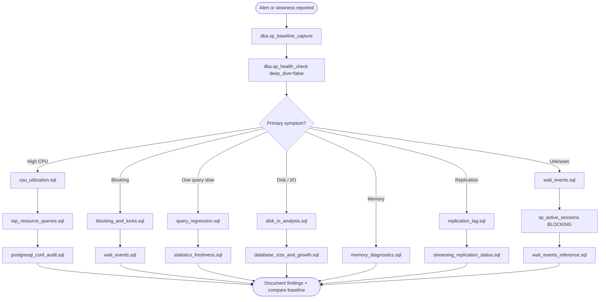

# PostgreSQL DBA Essential Scripts

> **Location:** This handbook lives under `postgres/` in the multi-platform [DBA Essential Scripts](../README.md) repository. The root [README.md](../README.md) contains **both** SQL Server and PostgreSQL documentation in one file.

A production-oriented **PostgreSQL diagnostic handbook** — a curated library of read-only SQL scripts for monitoring, troubleshooting, maintenance, and security on PostgreSQL 12+ clusters. Scripts are organized by troubleshooting layer (OS → instance → storage → performance → indexes → HA/DR → security → advanced) and designed to run safely against production systems.

Includes a **shell-based HTML handbook generator** (`shell/generate-dba-handbook.sh`) that embeds all scripts into a self-contained offline reference.

**Author:** Ravi Sharma  
**Platform:** PostgreSQL 12+ (15+ recommended for latest catalog views)

**Jump to:** [Quick Start](#quick-start) | [Installation](#installation-one-time-per-cluster) | [Cheat Sheet](#dba-cheat-sheet-one-page) | [Troubleshooting Flow](#troubleshooting-flow) | [Script Catalog](#script-catalog)

---

## What This Project Is

This is **not** a single monolithic tool. It is a **modular DBA toolkit** that provides:

1. **Standalone diagnostic scripts** — run with `psql -f` during incidents or scheduled health checks.
2. **Shared framework functions** — `dba` schema objects for consolidated reporting, wait filtering, and cross-cutting checks.
3. **An orchestrator** — `dba.sp_health_check()` aggregates findings into a prioritized dashboard with severity and recommendations.
4. **Modular wrapper functions** — `sp_active_sessions`, `sp_wait_analysis`, `sp_index_review`, `sp_security_audit`, `sp_backup_review`.
5. **Persistence layer** — `dba.sp_baseline_capture()` and `dba.baseline_snapshot` for historical trending.
6. **HTML handbook** — one-command generator for Linux/macOS with embedded scripts and checklists.

Use it as:

- A **daily/weekly health check** playbook for PostgreSQL DBAs
- An **on-call incident** reference ("blocking → run these scripts in this order")
- A **learning path** for developers moving into DBA work
- An **offline handbook** — generate HTML and use without repository access on jump hosts

---

## Who It Is For

| Audience | How to use this repo |
|----------|----------------------|
| **Production DBA** | Deploy framework once; run `dba.sp_health_check()` for triage; drill into folder scripts by area |
| **Junior DBA** | Start with `wait_events_reference.sql`; note `pg_postmaster_start_time()` before interpreting stats |
| **Database developer** | Use blocking, `pg_stat_statements`, and statistics scripts for app-impacting issues |
| **Linux ops / SRE** | Run `psql -f` scripts from cron or monitoring; generate HTML handbook for runbooks |

---

## Repository Structure

```
postgres/
├── 00_Framework/                  Functions & deploy script
│   ├── fn_dba_excluded_wait_events.sql
│   ├── sp_dba_health_check.sql
│   ├── sp_dba_active_sessions.sql
│   ├── sp_dba_wait_analysis.sql
│   ├── sp_dba_index_review.sql
│   ├── sp_dba_backup_review.sql
│   ├── sp_dba_security_audit.sql
│   ├── sp_dba_baseline_capture.sql
│   ├── 00_Deploy_Framework.sql
│   └── README.md
├── 00_Repository/                 dba_repository DDL bootstrap
│   ├── 00_create_repository.sql
│   └── README.md
├── 01_Server_OS/                  CPU, memory, disk I/O
├── 02_Instance_Config/            postgresql.conf, connections, extensions
├── 03_Storage/                    Size, bloat, WAL, tablespaces
├── 04_Performance_Diagnostics/    Waits, blocking, top queries, vacuum status
├── 05_Index_Statistics/           Usage, unused, stats, duplicates
├── 06_HA_DR/                      Streaming/logical replication, backups
├── 07_Security/                   Roles, SSL, passwords
├── 08_Advanced/                   Autovacuum, WAL/checkpoints, pg_stat_statements
├── 09_Maintenance/                Vacuum queue, long transactions, pg_cron
├── 10_Capacity_Planning/          Growth forecast
├── 11_Query_Analysis/             Query regression
├── 12_Extensions/                 Extension health
├── 13_Connection_Pooling/         Pool saturation signals
├── 14_Baselines/                  Point-in-time snapshots
├── preventive_measures/           Governance schema & policies
├── shell/                         HTML handbook generator (Linux/macOS)
│   ├── generate-dba-handbook.sh
│   ├── build_handbook.py
│   └── README.md
├── output/                        Generated DBA_Production_Handbook.html
├── _MASTER_INDEX.md               Quick file index
└── README.md                      This file
```

---

## Prerequisites

### PostgreSQL version

| Version | Support |
|---------|---------|
| PostgreSQL 12+ | Full support for core diagnostics |
| PostgreSQL 13+ | Improved monitoring views |
| PostgreSQL 14+ | Enhanced `pg_stat_statements` |
| PostgreSQL 15+ | Recommended for latest catalog views |

### Extensions (recommended)

| Extension | Needed for |
|-----------|------------|
| `pg_stat_statements` | `top_resource_queries.sql`, `pg_stat_statements_deep.sql`, `query_regression.sql` |

```sql
-- postgresql.conf
shared_preload_libraries = 'pg_stat_statements'
pg_stat_statements.track = all

-- per database
CREATE EXTENSION IF NOT EXISTS pg_stat_statements;
```

### Permissions (minimum)

| Role / grant | Needed for |
|--------------|------------|
| `pg_monitor` (PG 10+) | Most `pg_stat_*` views |
| `pg_read_all_stats` | All statistics views without superuser |
| Superuser | Repository create, framework deploy, some security checks |
| Owner of `dba` schema | Baseline capture, governance writes |

### Important: statistics reset on restart

These counters reset when PostgreSQL restarts (or after `pg_stat_reset()`):

- `pg_stat_database`, `pg_stat_user_tables`, `pg_stat_user_indexes`
- `pg_stat_statements` (unless persisted externally)

Always note `pg_postmaster_start_time()` before drawing conclusions. For trending, use `dba.sp_baseline_capture()` on a schedule.

---

## Installation (one-time per cluster)

### Option A: Full bootstrap (recommended)

```bash
cd postgres

# 1. Create dba_repository database and schema
psql -h HOST -U postgres -f 00_Repository/00_create_repository.sql

# 2. Deploy all framework functions
psql -h HOST -U postgres -d dba_repository -f 00_Framework/00_Deploy_Framework.sql

# 3. Optional: preventive governance layer
psql -h HOST -U postgres -d dba_repository -f preventive_measures/01_create_governance_schema.sql
```

### Option B: Framework only (existing admin database)

Deploy individual files from `00_Framework/` into your chosen database and ensure schema `dba` exists:

```bash
psql -h HOST -U postgres -d mydb -f 00_Framework/fn_dba_excluded_wait_events.sql
# ... remaining files in deploy order (see 00_Framework/README.md)
```

### Option C: Standalone scripts only (no deploy)

Most diagnostic scripts under `01_`–`14_` run without framework deploy. Scripts that call `dba.*` functions require Option A or B.

### Verify installation

```sql
\c dba_repository
\df dba.*
SELECT * FROM dba.sp_health_check(deep_dive => false);
```

Framework objects are **required** for:

- `dba.sp_health_check()` and all `dba.sp_*` wrappers
- `wait_events.sql` (benign wait filter when `dba` schema exists)
- `backup_verification.sql` (uses `dba.sp_backup_review` when available)

---

## Quick Start

### 1. Daily health triage (recommended)

```sql
\c dba_repository

-- Quick findings dashboard
SELECT * FROM dba.sp_health_check(deep_dive => false);

-- Full detail with wait breakdown
SELECT * FROM dba.sp_health_check(deep_dive => true, backup_hours_sla => 24);
```

### 2. Area-specific deep dives

```sql
\c dba_repository

-- Wait analysis with categories
SELECT * FROM dba.sp_wait_analysis(20);

-- Active sessions (blocking tree)
SELECT * FROM dba.sp_active_sessions(output_mode => 'BLOCKING');

-- Index health in current database
SELECT * FROM dba.sp_index_review(min_size_mb => 10);

-- Security audit
SELECT * FROM dba.sp_security_audit();

-- Backup / WAL archive review
SELECT * FROM dba.sp_backup_review(backup_hours_sla => 24);
```

### 3. Capture baseline for trending

```sql
\c dba_repository
SELECT dba.sp_baseline_capture();

-- Compare later snapshots
SELECT metric_area, metric_name, metric_value, snapshot_utc
FROM dba.baseline_snapshot
ORDER BY snapshot_utc DESC
LIMIT 50;
```

### 4. Run a standalone diagnostic script

```bash
psql -h HOST -U postgres -d mydb -f postgres/04_Performance_Diagnostics/blocking_and_locks.sql
```

### 5. Generate HTML handbook

```bash
cd postgres/shell
./generate-dba-handbook.sh
# Output: postgres/output/DBA_Production_Handbook.html
```

---

## DBA Cheat Sheet (One Page)

### First 60 seconds on any incident

```sql
SELECT pg_postmaster_start_time(), now();
SELECT dba.sp_baseline_capture();          -- requires framework
SELECT * FROM dba.sp_health_check(deep_dive => false);
SELECT * FROM dba.sp_active_sessions(output_mode => 'BLOCKING');
```

### Symptom → script (run in order)

| # | Symptom | Scripts |
|---|---------|---------|
| 1 | **High CPU** | `01_Server_OS/cpu_utilization.sql` → `04/top_resource_queries.sql` → `02/postgresql_conf_audit.sql` |
| 2 | **Blocking / hangs** | `04/blocking_and_locks.sql` → `04/wait_events.sql` |
| 3 | **One query got slow** | `11/query_regression.sql` → `05/statistics_freshness.sql` |
| 4 | **Slow disk / I/O** | `01/disk_io_analysis.sql` → `03/database_size_and_growth.sql` |
| 5 | **Memory pressure** | `01/memory_diagnostics.sql` → `04/wait_events.sql` |
| 6 | **Replication lag** | `06/replication_lag.sql` → `06/streaming_replication_status.sql` |
| 7 | **Backup / archive gap** | `06/backup_verification.sql` → `03/wal_archiving.sql` |
| 8 | **Bloat / vacuum lag** | `03/bloat_analysis.sql` → `09/vacuum_bloat_maintenance.sql` |
| 9 | **Daily / weekly health** | `dba.sp_health_check()` then drill by finding area |

*Paths shortened: `04` = `04_Performance_Diagnostics`, etc.*

### Top wait events → where to look

| Wait pattern | Likely cause | Script |
|--------------|--------------|--------|
| `Lock` / `relation` | Blocking | `blocking_and_locks.sql` |
| `IO` / `DataFileRead` | Disk read / cold cache | `disk_io_analysis.sql` |
| `WalSync` / `WalWrite` | WAL I/O | `checkpoint_and_wal.sql`, `wal_archiving.sql` |
| `Client` / `ClientRead` | App not consuming rows | `connection_analysis.sql` |
| `LWLock` / `BufferContent` | Hot page contention | `blocking_and_locks.sql` |
| `Timeout` | `statement_timeout` hit | `top_resource_queries.sql` |

### Key thresholds (defaults in scripts)

| Metric | Warning | Critical |
|--------|---------|----------|
| Connections vs `max_connections` | > 70% | > 80% |
| idle in transaction sessions | > 3 | > 5 |
| Replication lag | > 100 MB | > 1 GB |
| WAL archive age | > SLA hours | archive failures |
| Dead tuple % | > 10% | > 20% + stale vacuum |
| Buffer hit ratio (OLTP) | < 99% | < 95% |

### Essential commands (after framework install)

```sql
\c dba_repository

SELECT * FROM dba.sp_health_check(deep_dive => false);
SELECT * FROM dba.sp_wait_analysis(20);
SELECT * FROM dba.sp_active_sessions(output_mode => 'BLOCKING');
SELECT * FROM dba.sp_index_review(min_size_mb => 10);
SELECT * FROM dba.sp_security_audit();
SELECT * FROM dba.sp_backup_review(24);
SELECT dba.sp_baseline_capture();
```

### Do not do on first snapshot

- `VACUUM FULL` on large tables during peak without approval
- `DROP INDEX CONCURRENTLY` based on one snapshot of `idx_scan = 0`
- `pg_terminate_backend()` without identifying root cause and app owner
- Change `shared_buffers` or `max_connections` without restart plan

---

## Troubleshooting Flow



---

## Framework Objects (`00_Framework/`)

| Object | Purpose | How to run |
|--------|---------|------------|
| `dba.fn_excluded_wait_events()` | Benign wait events filter | Deploy once |
| `dba.sp_health_check()` | Consolidated health orchestrator | `SELECT * FROM dba.sp_health_check(deep_dive => false);` |
| `dba.sp_active_sessions()` | Session monitor DETAIL/BLOCKING | `SELECT * FROM dba.sp_active_sessions(output_mode => 'BLOCKING');` |
| `dba.sp_wait_analysis(n)` | Wait events with categories | `SELECT * FROM dba.sp_wait_analysis(20);` |
| `dba.sp_index_review()` | Index health in current DB | `SELECT * FROM dba.sp_index_review(min_size_mb => 10);` |
| `dba.sp_backup_review()` | WAL archive / PITR readiness | `SELECT * FROM dba.sp_backup_review(24);` |
| `dba.sp_security_audit()` | Roles, grants, SSL | `SELECT * FROM dba.sp_security_audit();` |
| `dba.sp_baseline_capture()` | Persist snapshot | `SELECT dba.sp_baseline_capture();` |

### `sp_health_check` parameters

| Parameter | Default | Description |
|-----------|---------|-------------|
| `deep_dive` | `false` | Include top wait event detail |
| `database_list` | `NULL` | Reserved for future DB scoping |
| `backup_hours_sla` | `24` | Hours since last archived WAL before warning |

---

## HTML Production Handbook

```bash
cd postgres/shell
./generate-dba-handbook.sh
```

| Feature | Description |
|---------|-------------|
| **14 playbook sections** | Principles through wait events KB |
| **Script Explorer** | All SQL files embedded — view, copy, highlight |
| **Checklists** | localStorage persistence |
| **Search** | Ctrl+K across sections and scripts |
| **Themes** | Dark / light; Junior / Senior DBA mode |

See [shell/README.md](shell/README.md).

---

## Script Catalog

Every script header includes **Description**, **Output**, **Action**, and **Criticality** where applicable.

> **How to run:** Replace `HOST`, `mydb`, and paths. Run from repository root or `cd postgres` and drop the `postgres/` prefix.

### `00_Repository/`

| File | What it does | Run when | How to run |
|------|--------------|----------|------------|
| `00_create_repository.sql` | Creates `dba_repository` DB and `dba` schema | One-time cluster setup | `psql -h HOST -U postgres -f postgres/00_Repository/00_create_repository.sql` |

### `00_Framework/`

| File | What it does | Run when | How to run |
|------|--------------|----------|------------|
| `00_Deploy_Framework.sql` | Deploys all `dba.*` functions | After repository create | `psql -h HOST -U postgres -d dba_repository -f postgres/00_Framework/00_Deploy_Framework.sql` |
| `fn_dba_excluded_wait_events.sql` | Benign wait event filter | Deploy only | Via `00_Deploy_Framework.sql` |
| `sp_dba_health_check.sql` | Health orchestrator | Daily triage, incidents | `psql -d dba_repository -c "SELECT * FROM dba.sp_health_check(deep_dive => false);"` |
| `sp_dba_active_sessions.sql` | Real-time sessions / blocking | Timeouts, blocking | `psql -d dba_repository -c "SELECT * FROM dba.sp_active_sessions(output_mode => 'BLOCKING');"` |
| `sp_dba_wait_analysis.sql` | Wait events + recommendations | "What is PG waiting on?" | `psql -d dba_repository -c "SELECT * FROM dba.sp_wait_analysis(20);"` |
| `sp_dba_index_review.sql` | Unused indexes, seq scans, missing FK indexes | Index maintenance | `psql -d TARGET_DB -c "SELECT * FROM dba.sp_index_review(10);"` |
| `sp_dba_backup_review.sql` | WAL archive / PITR readiness | Backup alerts, DR | `psql -d dba_repository -c "SELECT * FROM dba.sp_backup_review(24);"` |
| `sp_dba_security_audit.sql` | Superusers, PUBLIC grants, SSL | Security audit | `psql -d dba_repository -c "SELECT * FROM dba.sp_security_audit();"` |
| `sp_dba_baseline_capture.sql` | Persist performance snapshot | Before/after changes | `psql -d dba_repository -c "SELECT dba.sp_baseline_capture();"` |

### `01_Server_OS/` — Host & I/O pressure

| File | What it checks | Run when | How to run |
|------|----------------|----------|------------|
| `cpu_utilization.sql` | Backends by state, long active queries | High CPU | `psql -h HOST -U postgres -d mydb -f postgres/01_Server_OS/cpu_utilization.sql` |
| `memory_diagnostics.sql` | Memory GUCs, buffer hit ratio, grant waits | Memory pressure | `psql -h HOST -U postgres -d mydb -f postgres/01_Server_OS/memory_diagnostics.sql` |
| `disk_io_analysis.sql` | Per-DB/table I/O, checkpoint stats | I/O waits, slow reads | `psql -h HOST -U postgres -d mydb -f postgres/01_Server_OS/disk_io_analysis.sql` |

### `02_Instance_Config/` — Instance settings

| File | What it checks | Run when | How to run |
|------|----------------|----------|------------|
| `postgresql_conf_audit.sql` | Critical GUC parameters flagged | Baseline audit, migration | `psql -h HOST -U postgres -d mydb -f postgres/02_Instance_Config/postgresql_conf_audit.sql` |
| `connection_settings.sql` | Limits, timeouts, connection breakdown | Connection exhaustion | `psql -h HOST -U postgres -d mydb -f postgres/02_Instance_Config/connection_settings.sql` |
| `extension_audit.sql` | Installed extensions and versions | Post-upgrade inventory | `psql -h HOST -U postgres -d mydb -f postgres/02_Instance_Config/extension_audit.sql` |

### `03_Storage/` — Size, bloat & WAL

| File | What it checks | Run when | How to run |
|------|----------------|----------|------------|
| `database_size_and_growth.sql` | DB/table sizes, dead tuples | Disk space alerts | `psql -h HOST -U postgres -d mydb -f postgres/03_Storage/database_size_and_growth.sql` |
| `tablespace_audit.sql` | Tablespace locations and usage | Storage tier review | `psql -h HOST -U postgres -d mydb -f postgres/03_Storage/tablespace_audit.sql` |
| `bloat_analysis.sql` | Dead tuple ratio, vacuum lag | Bloat, autovacuum lag | `psql -h HOST -U postgres -d mydb -f postgres/03_Storage/bloat_analysis.sql` |
| `wal_archiving.sql` | WAL level, archive mode, archiver stats | Archive failures, PITR | `psql -h HOST -U postgres -d mydb -f postgres/03_Storage/wal_archiving.sql` |

### `04_Performance_Diagnostics/` — Active bottlenecks

| File | What it checks | Run when | How to run |
|------|----------------|----------|------------|
| `wait_events.sql` | Point-in-time waits with categories | First wait triage script | `psql -h HOST -U postgres -d mydb -f postgres/04_Performance_Diagnostics/wait_events.sql` |
| `wait_events_reference.sql` | Educational wait → action mapping | Learning / deep analysis | `psql -h HOST -U postgres -d mydb -f postgres/04_Performance_Diagnostics/wait_events_reference.sql` |
| `blocking_and_locks.sql` | Blocking chains, ungranted locks | App timeouts, Lock waits | `psql -h HOST -U postgres -d mydb -f postgres/04_Performance_Diagnostics/blocking_and_locks.sql` |
| `top_resource_queries.sql` | Top queries via `pg_stat_statements` | High CPU, slow queries | `psql -h HOST -U postgres -d mydb -f postgres/04_Performance_Diagnostics/top_resource_queries.sql` |
| `vacuum_analyze_status.sql` | Tables needing VACUUM/ANALYZE | Stale stats, bloat | `psql -h HOST -U postgres -d mydb -f postgres/04_Performance_Diagnostics/vacuum_analyze_status.sql` |

### `05_Index_Statistics/` — Indexes & statistics

| File | What it checks | Run when | How to run |
|------|----------------|----------|------------|
| `index_usage_efficiency.sql` | Seq vs index scan ratio | Index candidates | `psql -h HOST -U postgres -d mydb -f postgres/05_Index_Statistics/index_usage_efficiency.sql` |
| `unused_indexes.sql` | Zero-scan indexes above size threshold | Index cleanup | `psql -h HOST -U postgres -d mydb -f postgres/05_Index_Statistics/unused_indexes.sql` |
| `statistics_freshness.sql` | Stale stats by modification % | Plan regressions | `psql -h HOST -U postgres -d mydb -f postgres/05_Index_Statistics/statistics_freshness.sql` |
| `duplicate_indexes.sql` | Identical key-column indexes | Redundant index review | `psql -h HOST -U postgres -d mydb -f postgres/05_Index_Statistics/duplicate_indexes.sql` |

### `06_HA_DR/` — High availability & backups

| File | What it checks | Run when | How to run |
|------|----------------|----------|------------|
| `streaming_replication_status.sql` | Physical replica health, lag bytes | Replica unhealthy | `psql -h HOST -U postgres -d mydb -f postgres/06_HA_DR/streaming_replication_status.sql` (primary) |
| `replication_lag.sql` | Lag bytes/time with thresholds | Lag alerts | `psql -h HOST -U postgres -d mydb -f postgres/06_HA_DR/replication_lag.sql` (primary) |
| `logical_replication_status.sql` | Slots, publications, subscriptions | Logical repl lag | `psql -h HOST -U postgres -d mydb -f postgres/06_HA_DR/logical_replication_status.sql` |
| `backup_verification.sql` | WAL archive / PITR checks | Backup failures | `psql -h HOST -U postgres -d mydb -f postgres/06_HA_DR/backup_verification.sql` |

### `07_Security/` — Hardening & compliance

| File | What it checks | Run when | How to run |
|------|----------------|----------|------------|
| `role_privilege_audit.sql` | Roles, grants, PUBLIC exposure | Security audit | `psql -h HOST -U postgres -d mydb -f postgres/07_Security/role_privilege_audit.sql` |
| `connection_encryption.sql` | SSL settings and connection SSL usage | Compliance, TLS | `psql -h HOST -U postgres -d mydb -f postgres/07_Security/connection_encryption.sql` |
| `password_policy_audit.sql` | `password_encryption`, role expiry | Login review | `psql -h HOST -U postgres -d mydb -f postgres/07_Security/password_policy_audit.sql` |

### `08_Advanced/` — Feature-specific monitoring

| File | What it checks | Run when | How to run |
|------|----------------|----------|------------|
| `autovacuum_health.sql` | Autovacuum GUCs, workers, per-table opts | Vacuum lag | `psql -h HOST -U postgres -d mydb -f postgres/08_Advanced/autovacuum_health.sql` |
| `checkpoint_and_wal.sql` | Checkpoint frequency, WAL generation | Write spikes | `psql -h HOST -U postgres -d mydb -f postgres/08_Advanced/checkpoint_and_wal.sql` |
| `pg_stat_statements_deep.sql` | Variance, temp spill, I/O-heavy queries | Deep query dive | `psql -h HOST -U postgres -d mydb -f postgres/08_Advanced/pg_stat_statements_deep.sql` |
| `connection_analysis.sql` | Connection age, client patterns | Pool sizing | `psql -h HOST -U postgres -d mydb -f postgres/08_Advanced/connection_analysis.sql` |

### `09_Maintenance/` — Operational hygiene

| File | What it checks | Run when | How to run |
|------|----------------|----------|------------|
| `vacuum_bloat_maintenance.sql` | Prioritized VACUUM candidates + commands | Maintenance window | `psql -h HOST -U postgres -d mydb -f postgres/09_Maintenance/vacuum_bloat_maintenance.sql` |
| `long_running_transactions.sql` | Long xacts, idle-in-transaction, XID age | Wraparound risk | `psql -h HOST -U postgres -d mydb -f postgres/09_Maintenance/long_running_transactions.sql` |
| `pg_cron_job_status.sql` | pg_cron extension status | Job failures (if pg_cron used) | `psql -h HOST -U postgres -d mydb -f postgres/09_Maintenance/pg_cron_job_status.sql` |

### `10_Capacity_Planning/`

| File | What it checks | Run when | How to run |
|------|----------------|----------|------------|
| `database_growth_forecast.sql` | Sizes and growth indicators | Capacity planning | `psql -h HOST -U postgres -d mydb -f postgres/10_Capacity_Planning/database_growth_forecast.sql` |

### `11_Query_Analysis/`

| File | What it checks | Run when | How to run |
|------|----------------|----------|------------|
| `query_regression.sql` | High execution-time variance queries | Single query suddenly slow | `psql -h HOST -U postgres -d mydb -f postgres/11_Query_Analysis/query_regression.sql` |

### `12_Extensions/`

| File | What it checks | Run when | How to run |
|------|----------------|----------|------------|
| `extension_health.sql` | Extension versions, preload status | Post-upgrade review | `psql -h HOST -U postgres -d mydb -f postgres/12_Extensions/extension_health.sql` |

### `13_Connection_Pooling/`

| File | What it checks | Run when | How to run |
|------|----------------|----------|------------|
| `connection_pool_audit.sql` | Connection saturation vs max_connections | Deploy/tune PgBouncer | `psql -h HOST -U postgres -d mydb -f postgres/13_Connection_Pooling/connection_pool_audit.sql` |

### `14_Baselines/`

| File | What it checks | Run when | How to run |
|------|----------------|----------|------------|
| `performance_snapshot.sql` | Point-in-time counters in one run | Incident capture | `psql -h HOST -U postgres -d mydb -f postgres/14_Baselines/performance_snapshot.sql` |

### `preventive_measures/` — Governance (optional)

| File | What it does | Run when | How to run |
|------|--------------|----------|------------|
| `01_create_governance_schema.sql` | Alert and policy tables | One-time setup | `psql -d dba_repository -f postgres/preventive_measures/01_create_governance_schema.sql` |
| `02_capture_long_queries.sql` | Log long queries to `dba.governance_alert` | Scheduled (cron) | `psql -d dba_repository -f postgres/preventive_measures/02_capture_long_queries.sql` |
| `03_blocking_detection.sql` | Log blocking chains | Scheduled (cron) | `psql -d dba_repository -f postgres/preventive_measures/03_blocking_detection.sql` |
| `04_statement_timeout_policy.sql` | Review timeout GUC recommendations | Hardening | `psql -d mydb -f postgres/preventive_measures/04_statement_timeout_policy.sql` |
| `05_alert_views.sql` | Dashboard views on alerts | After schema deploy | `psql -d dba_repository -f postgres/preventive_measures/05_alert_views.sql` |

See [preventive_measures/README.md](preventive_measures/README.md).

---

## How to Run — Patterns

### Pattern A: Standalone script (most files)

```bash
psql -h HOST -U postgres -d mydb -f postgres/04_Performance_Diagnostics/wait_events.sql
```

### Pattern B: Framework function (after install)

```sql
\c dba_repository
SELECT * FROM dba.sp_health_check(deep_dive => false);
SELECT * FROM dba.sp_wait_analysis(20);
```

### Pattern C: Cron / automation

```bash
# Daily health — email output
psql -h HOST -U monitor -d dba_repository -t -A -c \
  "SELECT finding, recommendation FROM dba.sp_health_check(false) WHERE severity IN ('High','Critical');" \
  | mail -s "PG Health" dba@company.com
```

### Pattern D: Connection string / `.pgpass`

```bash
export PGHOST=prod-pg.internal PGUSER=monitor PGDATABASE=mydb
psql -f postgres/04_Performance_Diagnostics/blocking_and_locks.sql
```

### Pattern E: HTML handbook (offline runbook)

```bash
cd postgres/shell && ./generate-dba-handbook.sh
```

---

## Safety Notes

- Standalone scripts are **read-only** except deploy, baseline capture, and preventive measures.
- `pg_stat_*` and `pg_stat_statements` reset on restart — check `pg_postmaster_start_time()`.
- `bloat_analysis.sql` and large-catalog scans can be **expensive** — run off-peak.
- Do not drop indexes from a single `idx_scan = 0` snapshot without uptime context.
- Use `pg_cancel_backend()` before `pg_terminate_backend()`; get approval in production.

---

## Related Documentation

| File | Contents |
|------|----------|
| [00_Framework/README.md](00_Framework/README.md) | Framework deploy order |
| [00_Repository/README.md](00_Repository/README.md) | Repository bootstrap |
| [shell/README.md](shell/README.md) | HTML handbook generator |
| [preventive_measures/README.md](preventive_measures/README.md) | Governance layer |
| [_MASTER_INDEX.md](_MASTER_INDEX.md) | Quick file index |
| [../sql_server/README.md](../sql_server/README.md) | SQL Server handbook |

---

## Contributing & Customization

1. **Thresholds** — Edit variables at top of scripts or function parameters (`backup_hours_sla`, `min_size_mb`).
2. **SLA values** — Adjust backup hours and lag thresholds per environment.
3. **Scheduling** — Cron `sp_health_check` and `sp_baseline_capture` daily.
4. **Handbook** — Re-run `generate-dba-handbook.sh` after script changes.

---

## License

Copyright (c) Ravi Sharma. All rights reserved.
